# Mybatis

帮助文档：  https://mybatis.org/mybatis-3/index.html 

前提：

* JDBC
* Mysql
* Java基础
* Maven
* junit

## 1、 简介

### 1.1、 什么是Mybatis


* MyBatis是一-款优秀的持久层框架
* 它支持定制化SQL、存储过程以及高级映射。
* MyBatis避免了几乎所有的JDBC代码和手动设置参数以及获取结果集。
* MyBatis可以使用简单的XML或注解来配置和映射原生类型、接口和Java的POJO (Plain Old Java
  Objects,普通老式Java对象)为数据库中的记录。
* MyBatis本是apache的一个开源项目iBatis, 2010年这个项目由apache software foundation迁移到了
  google code,并且改名为MyBatis。
* 2013年11月迁移到Github。


如何获得Mybatis?

* maven仓库

  ```xml
  <!-- https://mvnrepository.com/artifact/org.mybatis/mybatis -->
  <dependency>
      <groupId>org.mybatis</groupId>
      <artifactId>mybatis</artifactId>
      <version>3.5.2</version>
  </dependency>
  ```

  

* github :  https://github.com/mybatis/mybatis-3/releases 

* 中文文档： https://mybatis.org/mybatis-3/index.html 

### 1.2、 持久化

数据持久化

* 持久化就是将程序的数据在持久状态和瞬时状态转化的过程
* 内存: **断电即失**
* 数据库(Jdbc), io文件持久化。
* 生活:冷藏.罐头。

为什么需要需要持久化?

* 有一些对象，不能让他丢掉。
* 内存太贵了

### 1.3、 持久层

Dao层、Service层，Controller层...

* 完成持久化工作的代码块
* 层界限十分明显。

### 1.4、 为什么需要Mybatis?

* 帮助程序猿将数据存入到数据库中。
* 方便
* 传统的JDBC代码太复杂了。简化。框架。自动化。
* 不用Mybatis也可以。更容易上手。技术没有高低之分
* 优点:
  * 简单易学
  * 灵活
  * sql和代码的分离，提高了可维护性。
  * 提供映射标签,支持对象与数据库的orm字段关系映射
  * 提供对象关系映射标签，支持对象关系组建维护
  * 提供xml标签，支持编写动态sql。

**最重要的一点：使用的人多！**

## 2、 第一个Mybatis程序

思路：搭建环境 --> 导入Mybatis --> 编写代码 --> 测试！

### 2.1、 搭建环境

搭建数据库

```sql
CREATE DATABASE mybatis;
USE mybatis;

CREATE TABLE `user` (
	id INT PRIMARY KEY AUTO_INCREMENT,
	`name` VARCHAR(20) ,
	pwd VARCHAR(16) 
) ENGINE=INNODB DEFAULT CHARSET='UTF8';

INSERT INTO `user`(`name`, pwd) VALUES
('Yoyo' , 'Yoyo123'),
('Tom' , 'Tom123'),
('Jack' , 'Jack123')
```

新建项目

1. 新建一个普通的maven项目

2. 删除scr目录.(当作父工程)

3. 导入项目依赖

   ```xml
       <!-- 导入依赖 -->
       <dependencies>
           <!-- mysql驱动 -->
           <dependency>
               <groupId>mysql</groupId>
               <artifactId>mysql-connector-java</artifactId>
               <version>5.1.47</version>
           </dependency>
   
           <!-- Mybatis -->
           <!-- https://mvnrepository.com/artifact/org.mybatis/mybatis -->
           <dependency>
               <groupId>org.mybatis</groupId>
               <artifactId>mybatis</artifactId>
               <version>3.5.2</version>
           </dependency>
           <!-- junit -->
           <dependency>
               <groupId>junit</groupId>
               <artifactId>junit</artifactId>
               <version>4.12</version>
           </dependency>
       </dependencies>
   ```

### 2.2、  创建一个模块

* 编写mybatis的核心配置文件

  ```xml
  <?xml version="1.0" encoding="UTF-8" ?>
          <!DOCTYPE configuration
                  PUBLIC "-//mybatis.org//DTD Config 3.0//EN"
                  "http://mybatis.org/dtd/mybatis-3-config.dtd">
  <!-- configuration 核心配置文件 -->
  <configuration>
      <!-- 环境组  default: 默认使用那个环境 -->
      <environments default="development">
          <!-- item 详细信息 id: 环境名称 -->
          <environment id="development">
              <!-- 事物管理  JDBC的事物管理 -->
              <transactionManager type="JDBC"/>
              <!-- 连接数据库的四个属性 -->
              <dataSource type="POOLED">
                  <property name="driver" value="com.mysql.jdbc.Driver"/>
                  <!-- useSLL：安全连接。 		useUnicode：是否使用Unicode编码   characterEncoding: 使用的字符集   &amp; = & 在xml中单独的&无法使用、需要转移 -->
                  <property name="url" value="jdbc:mysql://localhost:3306/mybatis?useSSL=true&amp;useUnicode=true&amp;characterEncoding=UTF-8"/>
                  <property name="username" value="root"/>
                  <property name="password" value="root"/>
              </dataSource>
          </environment>
      </environments>
      
      <!-- 每一个Mapper.XML 都需要在Mybatis核心配置文件中注册!! -->
      <mappers>
          <mapper resource="com/yh/dao/UserMapper.xml"/>
      </mappers>
      
  </configuration>
  ```

* 编写mybatis工具类

```java
public class MybatisUtils {
    private static SqlSessionFactory sqlSessionFactory;
    static {
        try {
            // 1. 获取sqlSessionFactory 对象
            String resource = "mybtais-config.xml";
            InputStream inputStream = Resources.getResourceAsStream(resource);
            sqlSessionFactory = new SqlSessionFactoryBuilder().build(inputStream);
        } catch (IOException e) {
            e.printStackTrace();
        }
    }
    // 既然有了 SqlSessionFactory，顾名思义，我们可以从中获得 SqlSession 的实例。
    // SqlSession 提供了在数据库执行 SQL 命令所需的所有方法
    public static SqlSession getSqlSession() {
        // sqlSessionFactory.openSession(boolean b); 	// 是否自动提交业务。
        return sqlSessionFactory.openSession();
    }
}
```

### 2.3、 编写代码

* 实体类

  ```java
  public class User {
      private Integer id;
      private String name;
      private String pwd;
  
      public User() {
      }
  
      public User(Integer id, String name, String pwd) {
          this.id = id;
          this.name = name;
          this.pwd = pwd;
      }
  
      public Integer getId() {
          return id;
      }
  
      public void setId(Integer id) {
          this.id = id;
      }
  
      public String getName() {
          return name;
      }
  
      public void setName(String name) {
          this.name = name;
      }
  
      public String getPwd() {
          return pwd;
      }
  
      public void setPwd(String pwd) {
          this.pwd = pwd;
      }
  }
  ```

* Dao接口

  ```java
  public interface UserDao {
      List<User> getUserList();
  }
  ```

* 接口实现类 由原来的userDaoImpl 转换为 Mapper.xml 配置文件

  ```xml
  <?xml version="1.0" encoding="UTF-8" ?>
  <!DOCTYPE mapper
          PUBLIC "-//mybatis.org//DTD Mapper 3.0//EN"
          "http://mybatis.org/dtd/mybatis-3-mapper.dtd">
  <!-- namespace：绑定一个对应的Dao/mapper接口 -->
  <mapper namespace="com.yh.dao.UserDao">
  
      <!-- select查询语句 resultType：返回集类型。只需要写真实的类。即泛型。需类全名  -->
      <select id="getUserList" resultType="com.yh.pojo.User">
          select * from User;
      </select>
  </mapper>
  ```

### 2.4、 测试

注意点:

org.apache.ibatis.binding.BindingException: Type interface com.yh.dao.UserDao is not known to the MapperRegistry.

MapperRegistry是什么？

核心配置文件中注册mappers

* junit测试

  ```java
      @Test
      public void testGetUserList() {
          // 1. 获取SqlSession对象
          SqlSession sqlSession = MybatisUtils.getSqlSession();
          // 2. 执行SQL
          // 方式1：T = getMapper(T t)
          UserDao mapper = sqlSession.getMapper(UserDao.class);
          List<User> userList = mapper.getUserList();
  
          // 方式2： sql.Session.selectList(String s); 不常用
          // List<User> userList = sqlSession.selectList("com.yh.dao.UserDao.getUserList");
          for (User user : userList) {
              System.out.println(user);
          }
  
          // 3. 关闭SqlSession
          sqlSession.close();
      }
  ```

可能遇到的问题：

1. 配置文件没有注册
2. 绑定接口错误
3. 方法名不对
4. 返回类型不对
5. Maven导出资源错误

### 2.5、 作用域（Scope)和声明周期

**对象生命周期和依赖注入框架**

#### SqlSessionFactoryBuilder

这个类可以被实例化、使用和丢弃，一旦创建了 SqlSessionFactory，就不再需要它了。 因此 SqlSessionFactoryBuilder 实例的最佳作用域是方法作用域（也就是局部方法变量）。 你可以重用 SqlSessionFactoryBuilder 来创建多个 SqlSessionFactory 实例，但最好还是不要一直保留着它，以保证所有的 XML 解析资源可以被释放给更重要的事情。

#### SqlSessionFactory

SqlSessionFactory 一旦被创建就应该在应用的运行期间一直存在，没有任何理由丢弃它或重新创建另一个实例。 使用 SqlSessionFactory 的最佳实践是在应用运行期间不要重复创建多次，多次重建 SqlSessionFactory 被视为一种代码“坏习惯”。因此 SqlSessionFactory 的最佳作用域是应用作用域。 有很多方法可以做到，最简单的就是使用单例模式或者静态单例模式。

#### SqlSession

每个线程都应该有它自己的 SqlSession 实例。SqlSession 的实例不是线程安全的，因此是不能被共享的，所以它的最佳的作用域是请求或方法作用域。 绝对不能将 SqlSession 实例的引用放在一个类的静态域，甚至一个类的实例变量也不行。 也绝不能将 SqlSession 实例的引用放在任何类型的托管作用域中，比如 Servlet 框架中的 HttpSession。 如果你现在正在使用一种 Web 框架，考虑将 SqlSession 放在一个和 HTTP 请求相似的作用域中。 换句话说，每次收到 HTTP 请求，就可以打开一个 SqlSession，返回一个响应后，就关闭它。 这个关闭操作很重要，为了确保每次都能执行关闭操作，你应该把这个关闭操作放到 finally 块中。 下面的示例就是一个确保 SqlSession 关闭的标准模式：


## 3、 CRUD

**一个接口对应一个xml配置文件。每一个对应的xml配置文件中都会有一个 mapper 标签。属性为 namespace**

### 3.1、 namespace

namespace中的包名要和 Dao/Mapper 接口的类名一致！

### 3.2、 select

选择、查询语句：

* id：namespace中的方法名
* resultType：sql语句的返回值
* parameterType：参数类型

1. 编写接口

   ```java
       /**
        * 根据Id查询用户
        * @param id 用户的id
        * @return 用户
        */
       User getUserById(int id);
   ```

2. 编写对应的mapper中的sql语句

   ```xml
       <select id="getUserById" resultType="com.yh.pojo.User" parameterType="int">
           select * from mybatis.user where id = #{id}
       </select>
   ```

3. 测试

   ```java
      /**
        * 根据id获取User对象
        */
       @Test
       public void testGetUserById() {
           SqlSession sql = MybatisUtils.getSqlSession();
           try{
               UserMapper mapper = sql.getMapper(UserMapper.class);
               System.out.println(mapper.getUserById(1));
           }finally{
               sql.close();
           }
       }
   ```

### 3.2、 Insert

```xml
    <insert id="addUser" parameterType="com.yh.pojo.User">
        insert into mybatis.user (`name`, pwd) values (#{name}, #{pwd});
    </insert>
```

### 3.3、 Update

```xml
    <update id="updateUser" parameterType="com.yh.pojo.User">
        update mybatis.user set `name` = #{name} ,pwd = #{pwd} where id = #{id};
    </update>
```

### 3.4、 Delete

```xml
    <delete id="removeUser" parameterType="int">
        delete from mybatis.user where id = #{id}
    </delete>
```

注意： 增删改需要提交事物

```java
    /**
     * 删除User
     */
    @Test
    public void testRemoveUser() {
        // 增删改需要提交事物
        SqlSession sql = MybatisUtils.getSqlSession();
        try {
            UserMapper mapper = sql.getMapper(UserMapper.class);
            boolean removeFlag = mapper.removeUser(6);
            if (removeFlag) {
                System.out.println("删除成功！");
                sql.commit(); // 提交事物
            } else {
                sql.rollback();
            }
        } finally {
            sql.close();
        }
    }
```

### 3.5、 Map

假设，我们的实体类，或者数据库中的表，字段或者参数过多，我们应当考虑使用Map!

* 接口

  ```java
      /**
       * 根据Id和name查询用户
       * @param map 查询的条件
       * @return 用户
       */
      User getUser2(Map<String, Object> map);
  ```

* XxxMapper.xml

  ```xml
      <select id="getUser2" resultType="com.yh.pojo.User" parameterType="map">
          select * from mybatis.user where id = #{userid} and name = #{username}
      </select>
  ```

* 测试

  ```java
      /**
       * 查询用户
       */
      @Test
      public void testgetUser2() {
          // 增删改需要提交事物
          SqlSession sql = MybatisUtils.getSqlSession();
          try {
              UserMapper mapper = sql.getMapper(UserMapper.class);
              Map map = new HashMap();
              map.put("userid", 1);
              map.put("username", "Yoyo");
              User user = mapper.getUser2(map);
              System.out.println(user);
          } finally {
              sql.close();
          }
      }
  ```

  

Map传递参数，直接在sq|中取出key即可! [parameterType="java.util.Map"] .

对象传递参数，直接在sq|中取对象的属性即可! [parameterType="类全名"]

只有一个基本类型参数的情况下，可以直接在sql中取到!

多个参数用Map,**或者注解!**

## 4、 配置解析

### 4.1、 核心配置文件

* mybatis-config.xml

* Mybatis的配置文件包含了会深深影响MyBatis行为和设置的属性信息

  ```xml
  configuration（配置）
      properties（属性）
      settings（设置）
      typeAliases（类型别名）
      typeHandlers（类型处理器）
      objectFactory（对象工厂）
      plugins（插件）
      environments（环境配置）
          environment（环境变量）
              transactionManager（事务管理器）
              dataSource（数据源）
      databaseIdProvider（数据库厂商标识）
      mappers（映射器）
  ```

### 4.2、 环境配置（environments）

 MyBatis 可以配置成适应多种环境，这种机制有助于将 SQL 映射应用于多种数据库之中。

 **尽管可以配置多个环境，但每个 SqlSessionFactory 实例只能选择一种环境。** 

```xml
<environments default="test">
  <!-- 默认的第一套环境 -->
  <environment id="development">
    <transactionManager type="JDBC">
      <property name="..." value="..."/>
    </transactionManager>
    <dataSource type="POOLED">
      <property name="driver" value="${driver}"/>
      <property name="url" value="${url}"/>
      <property name="username" value="${username}"/>
      <property name="password" value="${password}"/>
    </dataSource>
  </environment>
  
  <!-- 自己添加的第二套环境 -->
  <environment id="test">
    <transactionManager type="JDBC">
      <property name="..." value="..."/>
    </transactionManager>
    <dataSource type="POOLED">
      <property name="driver" value="${driver}"/>
      <property name="url" value="${url}"/>
      <property name="username" value="${username}"/>
      <property name="password" value="${password}"/>
    </dataSource>
  </environment>
</environments>
```

 **事务管理器（transactionManager）** 

在 MyBatis 中有两种类型的事务管理器（也就是 type="[JDBC|MANAGED]"）：

- （默认）JDBC – 这个配置直接使用了 JDBC 的提交和回滚设施，它依赖从数据源获得的连接来管理事务作用域。
- MANAGED – 这个配置几乎没做什么。它从不提交或回滚一个连接，而是让容器来管理事务的整个生命周期（比如 JEE 应用服务器的上下文）。 默认情况下它会关闭连接。然而一些容器并不希望连接被关闭，因此需要将 closeConnection 属性设置为 false 来阻止默认的关闭行为。
- **如果你正在使用 Spring + MyBatis，则没有必要配置事务管理器，因为 Spring 模块会使用自带的管理器来覆盖前面的配置。 **

 **数据源（dataSource）** 

 dataSource 元素使用标准的 JDBC 数据源接口来配置 JDBC 连接对象的资源。 

 大多数 MyBatis 应用程序会按示例中的例子来配置数据源。虽然数据源配置是可选的，但如果要启用延迟加载特性，就必须配置数据源。 

 有三种内建的数据源类型（也就是 type="[UNPOOLED|POOLED|JNDI]");

* **UNPOOLED**– 这个数据源的实现会每次请求时打开和关闭连接。虽然有点慢，但对那些数据库连接可用性要求不高的简单应用程序来说，是一个很好的选择。 性能表现则依赖于使用的数据库，对某些数据库来说，使用连接池并不重要，这个配置就很适合这种情形。 
* （默认） **POOLED**– 这种数据源的实现利用“池”的概念将 JDBC 连接对象组织起来，避免了创建新的连接实例时所必需的初始化和认证时间。 
*  **JNDI** – 这个数据源实现是为了能在如 EJB 或应用服务器这类容器中使用，容器可以集中或在外部配置数据源，然后放置一个 JNDI 上下文的数据源引用。 

### 4.3、 属性（properties）

我们可以通过proeties属性来实现引用配置文件

 这些属性可以在外部进行配置，并可以进行动态替换。你既可以在典型的 Java 属性文件中配置这些属性，也可以在 properties 元素的子元素中设置  【properties】

properties标签只能写在mybatis-config.xml 中 configuration 中的第一行

编写一个配置文件

db.properties

```properties
driver=com.mysql.jdbc.Driver
url=jdbc:mysql://localhost:3306/mybatis?useSSL=true&useUnicode=true&characterEncoding=UTF-8
user=root
password=root
```

在核心配置文件中引入

```xml
    <!-- 引入外部配置文件 -->
	<properties resource="db.properties">
        <property name="user" value="root"/>
        <property name="password" value="123456"/>
    </properties>
	<!-- 引入后就可以使用了 -->
    <!-- 环境组  default: 使用那个环境 -->
    <environments default="development">        
          <!-- 自己添加的第二套环境 -->
          <environment id="development">
            <transactionManager type="JDBC">
              <property name="..." value="..."/>
            </transactionManager>
            <dataSource type="POOLED">
              <property name="driver" value="${driver}"/>
              <property name="url" value="${url}"/>
              <property name="username" value="${user}"/>
              <property name="password" value="${password}"/>
            </dataSource>
          </environment>
        
        <!-- item 详细信息 id: 环境名称 -->
        <environment id="test">
            <!-- 事物管理  JDBC的事物管理 -->
            <transactionManager type="JDBC"/>
            <!-- 连接数据库的四个属性 -->
            <dataSource type="POOLED">
                <property name="driver" value="com.mysql.jdbc.Driver"/>
                <!-- useSLL：安全连接。 useUnicode：是否使用Unicode编码   characterEncoding: 使用的字符集   &amp; = & 在xml中单独的&无法使用、需要转移 -->
                <property name="url" value="jdbc:mysql://localhost:3306/mybatis?useSSL=true&amp;useUnicode=true&amp;characterEncoding=UTF-8"/>
                <property name="username" value="root"/>
                <property name="password" value="root"/>
            </dataSource>
        </environment>
    </environments>
```

* 可以直接引入外部文件
* 可以在其中增加一些属性配置
* 如果两个文件有同一个字段，优先使用外部配置文件的!

### 4.4、 类型别名（typeAliases）

* 类型别名可为 Java 类型设置一个缩写名字。 
* 意在降低冗余的全限定类名书写。 

```xml
    <!-- 给实体类起别名 -->
    <typeAliases>
        <typeAlias type="com.yh.pojo.User" alias="User"/>
    </typeAliases>
```

也可以指定一个包名，MyBatis 会在包名下面搜索需要的Java Bean,比如:

扫描实体类的包，它的默认别名就为这个类的类名,首字母小写!

```xml
    <!-- 给实体类起别名 -->
    <typeAliases>
        <package name="com.yh.pojo"/>
    </typeAliases>
```

在实体类比较少的时候，使用第一种方式。

如果实体类十分多，建议使用第二种。

第一种可以DIY别名，第二种则不行，如果非要改,需要在实体上增加注解

```java
@Alias("MyLabel")
public class User {
	...
}
```

 常见的 Java 类型内建的类型别名。它们都是不区分大小写的，注意，为了应对原始类型的命名重复，采取了特殊的命名风格。 

| 别名       | 映射的类型 |
| :--------- | :--------- |
| _byte      | byte       |
| _long      | long       |
| _short     | short      |
| _int       | int        |
| _integer   | int        |
| _double    | double     |
| _float     | float      |
| _boolean   | boolean    |
| string     | String     |
| byte       | Byte       |
| long       | Long       |
| short      | Short      |
| int        | Integer    |
| integer    | Integer    |
| double     | Double     |
| float      | Float      |
| boolean    | Boolean    |
| date       | Date       |
| decimal    | BigDecimal |
| bigdecimal | BigDecimal |
| object     | Object     |
| map        | Map        |
| hashmap    | HashMap    |
| list       | List       |
| arraylist  | ArrayList  |
| collection | Collection |
| iterator   | Iterator   |

### 4.5、 设置（settings）

 这是 MyBatis 中极为重要的调整设置，它们会改变 MyBatis 的运行时行为。  


| 设置名                           | 描述                                                         | 有效值                                                       | 默认值                                                |
| :------------------------------- | :----------------------------------------------------------- | :----------------------------------------------------------- | :---------------------------------------------------- |
| **cacheEnabled**                 | 全局性地开启或关闭所有映射器配置文件中已配置的任何缓存。     | true \| false                                                | true                                                  |
| **lazyLoadingEnabled**           | 延迟加载的全局开关。当开启时，所有关联对象都会延迟加载。 特定关联关系中可通过设置 `fetchType` 属性来覆盖该项的开关状态。 | true \| false                                                | false                                                 |
| aggressiveLazyLoading            | 开启时，任一方法的调用都会加载该对象的所有延迟加载属性。 否则，每个延迟加载属性会按需加载（参考 `lazyLoadTriggerMethods`)。 | true \| false                                                | false （在 3.4.1 及之前的版本中默认为 true）          |
| multipleResultSetsEnabled        | 是否允许单个语句返回多结果集（需要数据库驱动支持）。         | true \| false                                                | true                                                  |
| useColumnLabel                   | 使用列标签代替列名。实际表现依赖于数据库驱动，具体可参考数据库驱动的相关文档，或通过对比测试来观察。 | true \| false                                                | true                                                  |
| useGeneratedKeys                 | 允许 JDBC 支持自动生成主键，需要数据库驱动支持。如果设置为 true，将强制使用自动生成主键。尽管一些数据库驱动不支持此特性，但仍可正常工作（如 Derby）。 | true \| false                                                | False                                                 |
| autoMappingBehavior              | 指定 MyBatis 应如何自动映射列到字段或属性。 NONE 表示关闭自动映射；PARTIAL 只会自动映射没有定义嵌套结果映射的字段。 FULL 会自动映射任何复杂的结果集（无论是否嵌套）。 | NONE, PARTIAL, FULL                                          | PARTIAL                                               |
| autoMappingUnknownColumnBehavior | 指定发现自动映射目标未知列（或未知属性类型）的行为。`NONE`: 不做任何反应`WARNING`: 输出警告日志（`'org.apache.ibatis.session.AutoMappingUnknownColumnBehavior'` 的日志等级必须设置为 `WARN`）`FAILING`: 映射失败 (抛出 `SqlSessionException`) | NONE, WARNING, FAILING                                       | NONE                                                  |
| defaultExecutorType              | 配置默认的执行器。SIMPLE 就是普通的执行器；REUSE 执行器会重用预处理语句（PreparedStatement）； BATCH 执行器不仅重用语句还会执行批量更新。 | SIMPLE REUSE BATCH                                           | SIMPLE                                                |
| defaultStatementTimeout          | 设置超时时间，它决定数据库驱动等待数据库响应的秒数。         | 任意正整数                                                   | 未设置 (null)                                         |
| defaultFetchSize                 | 为驱动的结果集获取数量（fetchSize）设置一个建议值。此参数只可以在查询设置中被覆盖。 | 任意正整数                                                   | 未设置 (null)                                         |
| defaultResultSetType             | 指定语句默认的滚动策略。（新增于 3.5.2）                     | FORWARD_ONLY \| SCROLL_SENSITIVE \| SCROLL_INSENSITIVE \| DEFAULT（等同于未设置） | 未设置 (null)                                         |
| safeRowBoundsEnabled             | 是否允许在嵌套语句中使用分页（RowBounds）。如果允许使用则设置为 false。 | true \| false                                                | False                                                 |
| safeResultHandlerEnabled         | 是否允许在嵌套语句中使用结果处理器（ResultHandler）。如果允许使用则设置为 false。 | true \| false                                                | True                                                  |
| **mapUnderscoreToCamelCase**     | 是否开启驼峰命名自动映射，即从经典数据库列名 A_COLUMN 映射到经典 Java 属性名 aColumn。 | true \| false                                                | False                                                 |
| localCacheScope                  | MyBatis 利用本地缓存机制（Local Cache）防止循环引用和加速重复的嵌套查询。 默认值为 SESSION，会缓存一个会话中执行的所有查询。 若设置值为 STATEMENT，本地缓存将仅用于执行语句，对相同 SqlSession 的不同查询将不会进行缓存。 | SESSION \| STATEMENT                                         | SESSION                                               |
| jdbcTypeForNull                  | 当没有为参数指定特定的 JDBC 类型时，空值的默认 JDBC 类型。 某些数据库驱动需要指定列的 JDBC 类型，多数情况直接用一般类型即可，比如 NULL、VARCHAR 或 OTHER。 | JdbcType 常量，常用值：NULL、VARCHAR 或 OTHER。              | OTHER                                                 |
| lazyLoadTriggerMethods           | 指定对象的哪些方法触发一次延迟加载。                         | 用逗号分隔的方法列表。                                       | equals,clone,hashCode,toString                        |
| defaultScriptingLanguage         | 指定动态 SQL 生成使用的默认脚本语言。                        | 一个类型别名或全限定类名。                                   | org.apache.ibatis.scripting.xmltags.XMLLanguageDriver |
| defaultEnumTypeHandler           | 指定 Enum 使用的默认 `TypeHandler` 。（新增于 3.4.5）        | 一个类型别名或全限定类名。                                   | org.apache.ibatis.type.EnumTypeHandler                |
| callSettersOnNulls               | 指定当结果集中值为 null 的时候是否调用映射对象的 setter（map 对象时为 put）方法，这在依赖于 Map.keySet() 或 null 值进行初始化时比较有用。注意基本类型（int、boolean 等）是不能设置成 null 的。 | true \| false                                                | false                                                 |
| returnInstanceForEmptyRow        | 当返回行的所有列都是空时，MyBatis默认返回 `null`。 当开启这个设置时，MyBatis会返回一个空实例。 请注意，它也适用于嵌套的结果集（如集合或关联）。（新增于 3.4.2） | true \| false                                                | false                                                 |
| logPrefix                        | 指定 MyBatis 增加到日志名称的前缀。                          | 任何字符串                                                   | 未设置                                                |
| **logImpl**                      | 指定 MyBatis 所用日志的具体实现，未指定时将自动查找。        | SLF4J \| LOG4J \| LOG4J2 \| JDK_LOGGING \| COMMONS_LOGGING \| STDOUT_LOGGING \| NO_LOGGING | 未设置                                                |
| proxyFactory                     | 指定 Mybatis 创建可延迟加载对象所用到的代理工具。            | CGLIB \| JAVASSIST                                           | JAVASSIST （MyBatis 3.3 以上）                        |
| vfsImpl                          | 指定 VFS 的实现                                              | 自定义 VFS 的实现的类全限定名，以逗号分隔。                  | 未设置                                                |
| useActualParamName               | 允许使用方法签名中的名称作为语句参数名称。 为了使用该特性，你的项目必须采用 Java 8 编译，并且加上 `-parameters` 选项。（新增于 3.4.1） | true \| false                                                | true                                                  |
| configurationFactory             | 指定一个提供 `Configuration` 实例的类。 这个被返回的 Configuration 实例用来加载被反序列化对象的延迟加载属性值。 这个类必须包含一个签名为`static Configuration getConfiguration()` 的方法。（新增于 3.2.3） | 一个类型别名或完全限定类名。                                 | 未设置                                                |

### 4.6、 映射器（mappers）

MapperRegistry:注册绑定我们的Mapper文件;

方式1：使用资源路径绑定 【推荐使用】

```xml
    <!-- 每一个Mapper.XML 都需要在Mybatis核心配置文件中注册!! -->
	<mappers>
        <mapper resource="com/yh/dao/UserMapper.xml"/>
    </mappers>
```

方式2：使用class文件绑定注册

```xml
    <!-- 每一个Mapper.XML 都需要在Mybatis核心配置文件中注册!! -->
    <mappers>
        <!-- 接口类名 -->
        <mapper class="com.yh.dao.UserMapper"/>
    </mappers>
```

注意点：

* maven中需要设置resources，防止资源导出失败的问题
* 接口和他的Mapper配置文件必须同名!
* 接口和他的Mapper配置文件必须在同一一个包下!

方式3：使用扫描包进行注入绑定

```xml
    <!-- 每一个Mapper.XML 都需要在Mybatis核心配置文件中注册!! -->
    <mappers>
   		<package name="com.yh.dao"/>
	</mappers>
```

注意点：

* maven中需要设置resources，防止资源导出失败的问题
* 接口和他的Mapper配置文件必须同名!
* 接口和他的Mapper配置文件必须在同一一个包下!

### 4.7、  生命周期和作用域

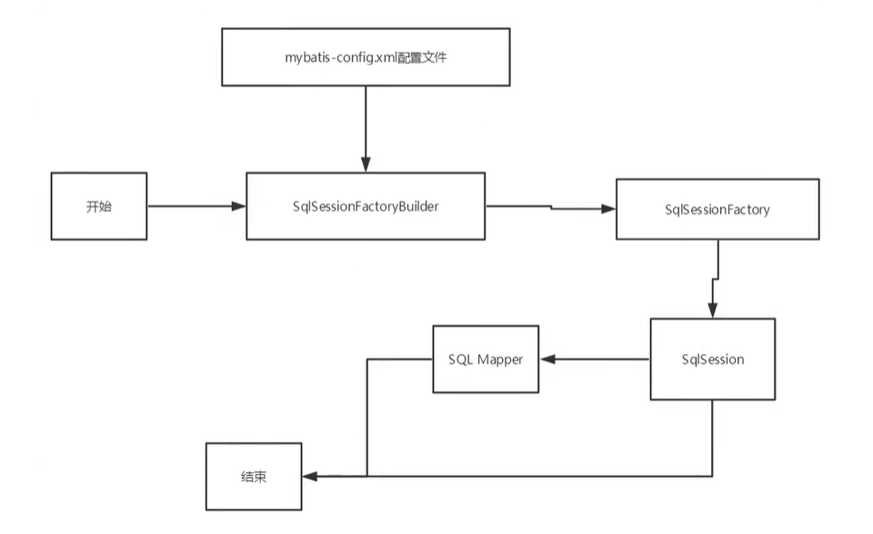

生命周期，和作用域，是至关重要的，因为错误的使用会导致非常严重的**并发问题**。

**SqlSessionFactoryBuider**: 

* 一旦创建了 SqlSessionFactory, 就不再需要它了
* 局部变量

**SqlSessionFactory**:

* 说白了就是可以想象为:数据库连接池
* SqlSessionFactory 一旦被创建就应该在应用的运行期间一直存在，**没有任何理由丢弃它或重新创建
  另一个实例**。
* 因此SqlSessionFactory的最佳作用域是应用作用域。
* 最简单的就是使用**单例模式**或者静态单例模式。

**SqlSession**

* 连接到连接池的一个请求! .
* SqlSession的实例不是线程安全的，因此是不能被共享的，所以它的最佳的作用域是请求或方法作用
  域。
* 用完之后需要赶紧关闭，否则资源被占用!

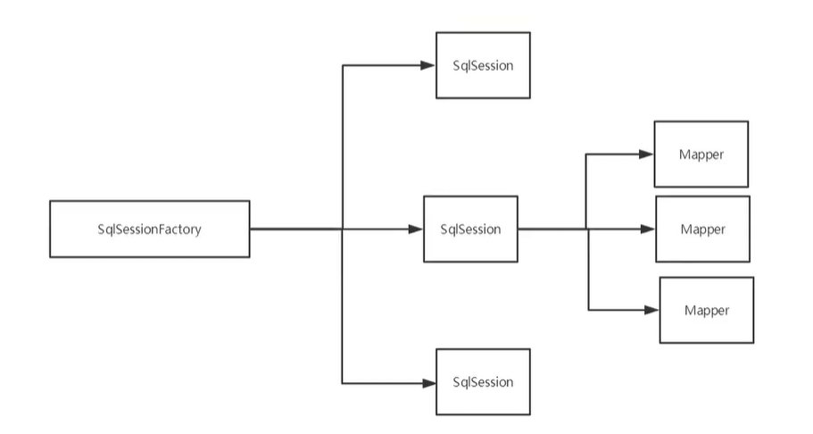

这里面的每一个Mapper, 就代表一个具体的业务!

### 4.8、 其他配置

- [typeHandlers（类型处理器）](https://mybatis.org/mybatis-3/zh/configuration.html#typeHandlers)
- [objectFactory（对象工厂）](https://mybatis.org/mybatis-3/zh/configuration.html#objectFactory)
-  [plugins（插件）](https://mybatis.org/mybatis-3/zh/configuration.html#plugins) 
  - mybatis-generator-core
  - mybatis-plus
  - 通用mapper

## 5、 解决属性名和字段名不一致的问题

数据库

```sql
CREATE TABLE `user` (
	id INT PRIMARY KEY AUTO_INCREMENT,
	`name` VARCHAR(20) ,
	pwd VARCHAR(16) 
) ENGINE=INNODB DEFAULT CHARSET='UTF8';
```

实体类

```java
public class User {
    private Integer id;
    private String name;
    private String password;
}
```

mapper

```xml
    <select id="getUserById" parameterType="int" resultType="User">
        select * from mybatis.user where id = #{id};
    </select>
User{id=2, name='Tom', password='null'}
```

让数据库的pwd 映射实体类的 password 

解决方法：

* 起别名、讲数据库中的字段名称起一个和Java类中属性一样的别名。

  ```xml
      <select id="getUserById" parameterType="int" resultType="User">
          select id, name, pwd password from mybatis.user where id = #{id};
      </select>
  User{id=2, name='Tom', password='Tom123'}
  ```

* resultMap

### resultMap

结果集映射

```xml
<mapper namespace="com.yh.dao.UserMapper_03">

    <!-- id：标识符， type：真实返回的类型 -->
    <resultMap id="getUserById" type="User">
<!--        <result property="id" column="id"/>-->
<!--        <result property="name" column="name"/>-->
        <!-- result：在返回的结果中修改 -->
        <!-- property：属性，实体类中的属性。 column：列。数据库中列。 产生映射关系 -->
        <!-- 如果属性和列的名称一致。则不需要再次显示规定。默认即可 -->
        <result property="password" column="pwd"/>
    </resultMap>

    <!-- resultMap：resultMap标签的id 因为它  -->
    <select id="getUserById" parameterType="int" resultMap="getUserById">
        select * from mybatis.user where id = #{id};
    </select>

</mapper>
```


* resultMap元素是MyBatis中最重要最强大的元素
* ResultMap的设计思想是，对于简单的语句根本不需要配置显式的结果映射，而对于复杂-点的语句
* 只需要描述它们的关系就行了。
* Resu1tMap最优秀的地方在于，虽然你已经对它相当了解了，但是根本就不需要显式地用到他们。
* 如果世界总是这么简单就好了。

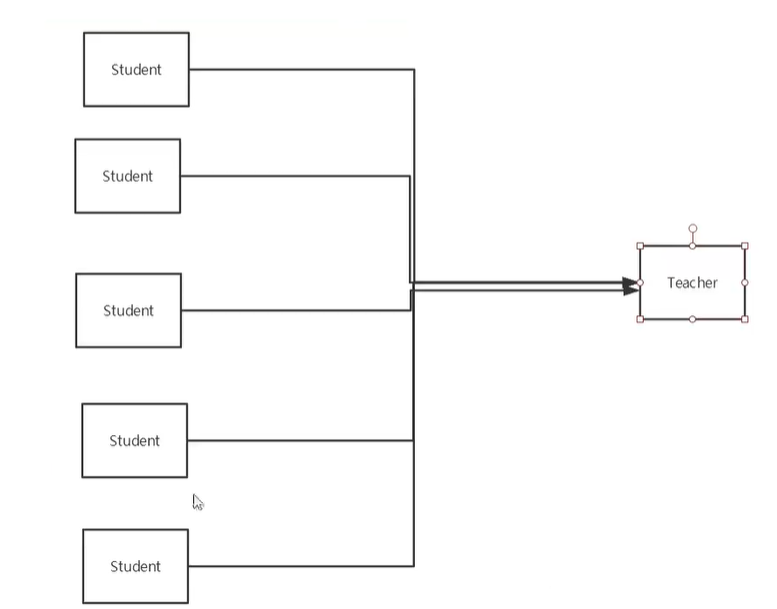

## 6、 日志

### 6.1、 日志工厂

如果一个数据库操作，出现了异常,我们需要排错。日志就是最好的助手!

曾经: sout、 debug
现在:日志工厂!

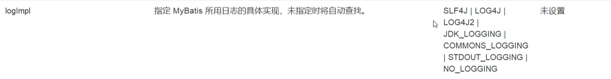

* SLF4J
* LOG4J     [掌握]
* LOG4J2
* jDK_LOGGING
* COMMONS_LOGGING
* STDOUT_LOGGING    [掌握]
* NO_LOGGING

在Mybatis中具体使用那个一日志实现，在设置中设定!

**STDOUT_LOGGING标准日志输出**

在mybatis核心配置文件中，配置我们的日志!

```xml
    <settings>
        <!-- 标准的工厂日志实现 -->
        <setting name="logImpl" value="STDOUT_LOGGING"/>
    </settings>
```


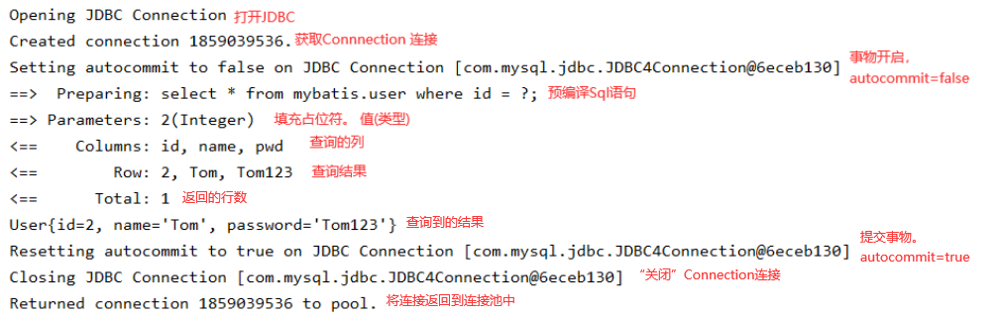

### 6.2、 Log4j

什么是Log4j？

* Log4j是Apache的一个开源项目，通过使用Log4j, 我们可以控制日志信息输送的目的地是控制台、文件、GUI组件
* 我们也可以控制每一条日志的输出格式;
* 通过定义每一条日志信息的级别， 我们能够更加细致地控制日志的生成过程。
* 通过一个配置文件来灵活地进行配置，而不需要修改应用的代码。

1. 导入Log4j的包

   ```xml
           <dependency>
               <groupId>log4j</groupId>
               <artifactId>log4j</artifactId>
               <version>1.2.17</version>
           </dependency>
   ```

2. log4j.properties

   ```properties
   #将等级为DEBUG的日志信息输出到console和file这两个目的地，console和file的定义在下面的代码
   log4j.rootLogger=DEBUG,console,file
   
   #控制台输出的相关设置
   log4j.appender.console = org.apache.log4j.ConsoleAppender
   log4j.appender.console.Target = System.out
   log4j.appender.console.Threshold=DEBUG
   log4j.appender.console.layout = org.apache.log4j.PatternLayout
   log4j.appender.console.layout.ConversionPattern=[%c]-%m%n
   
   #文件输出的相关设置
   log4j.appender.file = org.apache.log4j.RollingFileAppender
   log4j.appender.file.File=./log/yh.log
   log4j.appender.file.MaxFileSize=10mb
   log4j.appender.file.Threshold=DEBUG
   log4j.appender.file.layout=org.apache.log4j.PatternLayout
   log4j.appender.file.layout.ConversionPattern=[%p][%d{yy-MM-dd}][%c]%m%n
   
   #日志输出级别
   log4j.logger.org.mybatis=DEBUG
   log4j.logger.java.sql=DEBUG
   log4j.logger.java.sql.Statement=DEBUG
   log4j.logger.java.sql.ResultSet=DEBUG
   log4j.logger.java.sql.PreparedStatement=DEBUG
   ```

3. .配置log4j为日志的实现

   ```xml
       <settings>
           <setting name="logImpl" value="LOG4J"/>
       </settings>  
   ```

4. Log4j的使用  刚才的代码

   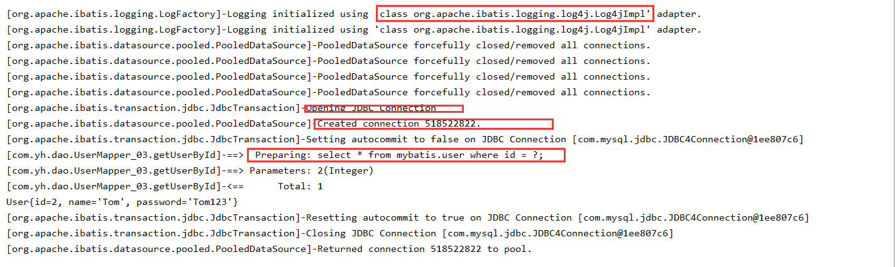

**简单实用**

1. 在要使用Log4j的类中，导入包import org.apache.log4j.Logger;

2. 日志对象，参数为当前类的class

   ```java
       private static Logger logger = Logger.getLogger(UserMapperTest.class);
   ```

3. 日志级别 常用

   ```JAVA
   		logger.info("info:进入了testLog4jDemo");
           logger.debug("debug:进入了testLog4jDemo");
           logger.error("error:进入了te1stLog4jDemo");
   ```

   

## 7、 分页

**思考:为什么要分页?**

* 减少数据的处理量
* 简洁化


### 7.1、 使用Limit分页

语法

```sql
SELECT * FROM user LIMIT startIndex, pageSize;
	SELECT * FROM user LIMIT 0, 2; #[0, n]
```


使用Mybatis实现分页。核心SQL

1. 接口

   ```java
       List<User> getUserList(Map<String, Object> map);
   ```

2. Mapper.xml

   ```xml
       <select id="getUserByLimit" parameterType="map" resultMap="UserMap">
           select * from mybatis.user limit #{startIndex}, #{pageSize};
       </select>
   ```

3. 测试

   ```java
       @TestG
       public void testGetUserByLimit(){
           SqlSession ss = MybatisUtils.getSqlSession();
   
           UserMapper_03 mapper = ss.getMapper(UserMapper_03.class);
   
           Map<String, Object> map = new HashMap<String, Object>();
           map.put("startIndex", 0);
           map.put("pageSize", 2);
           List<User> userList = mapper.getUserByLimit(map);
           for (User user : userList) {
               System.out.println(user);
           }
           ss.close();
       }
   ```

### 7.2、 RowBounds分页

不再使用SQL实现分页

1. 接口

   ```java
       List<User_03> getUserByRowBounds();
   ```

2. Mapper.xml

   ```xml
       <select id="getUserByRowBounds" resultMap="UserMap">
           select * from mybatis.user;
       </select>
   ```

3. 测试

   ```java
       @Test
       public void testGetUserByRowBounds(){
           SqlSession ss = MybatisUtils.getSqlSession();
   
           RowBounds rowBounds = new RowBounds(0, 2);
   
           List<User> userList = ss.selectList("com.yh.dao.UserMapper.getUserByRowBounds", null , rowBounds);
   
           for (User user : userList) {
               System.out.println(user);
           }
           ss.close();
       }
   ```

## 8、 使用注解开发

### 8.1、 面向接口编程

​	之前学过面向对象编程,也学习过接口，但在真正的开发中，很多时候我们会选择面向接口编程
​	**根本原因: ==解耦== ,可拓展,提高复用,分层开发中,上层不用管具体的实现,大家都遵守共同的标准, 使得开发变得容易,规范性更好**
​	在一个面向对象的系统中，系统的各种功能是由许许多多的不同对象协作完成的。在这种情况下，各个对象内部是如何实现自己的,对系统设计人员来讲就不那么重要了;
​	而各个对象之间的协作关系则成为系统设计的关键。小到不同类之间的通信，大到各模块之间的交互，在系统设计之初都是要着重考虑的，这也是系统设计的主要工作内容。面向接口编程就是指按照这种思想来编程。

**关于接口的理解**
	接口从更深层次的理解，应是定义(规范，约束)与实现(名实分离的原则)的分离。
	接口的本身反映了系统设计人员对系统的抽象理解。
	接口应有两类:
		第一类是对一个个体的抽象,它可对应为一一个抽象体(abstract class); .
		第二类是对一一个个体某- -方面的抽象, 即形成- -个抽象面(interface) ;
	一个体有可能有多个抽象面。抽象体与抽象面是有区别的。

**三个面向区别**
	面向对象是指，我们考虑问题时，以对象为单位,考虑它的属性及方法.
	面向过程是指，我们考虑问题时，以一个具体的流程(事务过程)为单位,考虑它的实现.
	接口设计与非接口设计是针对复用技术而言的，与面向对象(过程)不是一个问题.更多的体现就是对系统整体的架构

### 8.2、 使用注解开发

1. 注解在接口上实现

   ```java
       @Select("select id, name, pwd password from User")
       List<User> getUsers();
   ```

2. 需要在核心配置文件中绑定接口！

   ```xml
       <!-- 绑定接口-->
       <mappers>
           <mapper class="com.yh.dao.UserMapper"/>
       </mappers>
   ```

3. 测试

   ```java
       @Test
       public void testGetUsers(){
           SqlSession ss = MybatisUtils.getSqlSession();
   
           UserMapper mapper = ss.getMapper(UserMapper.class);
   
           List<User> userList = mapper.getUsers();
           for (User user : userList) {
               System.out.println(user);
           }
           ss.close();
       }
   ```

   本质:反射机制实现

   底层:动态代理!

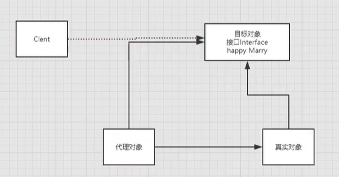

**Mybatis详细的执行流程！**

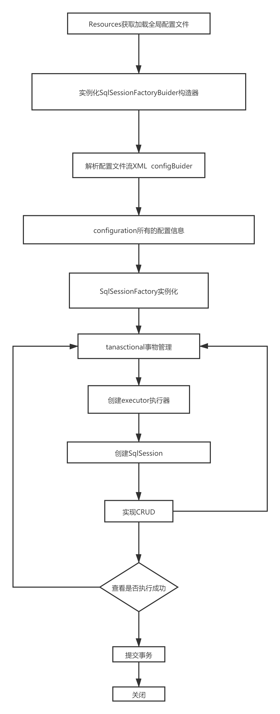

### 8.3、 CRUD

接口

```java
    @Select("select id, name, pwd password from User where id = #{userId}")
    User getUserById(@Param("userId")int id);

    @Insert("insert into user(name, pwd) values(#{name}, #{password})")
    int insertUser(User user);

    @Update("update user set name = #{userName} where id = #{userId}")
    int updateUser(@Param("userId") int id, @Param("userName") String name);

    @Delete("delete from user where id = #{id}")
    int removeUserById(@Param("id") int id);
```

注意：我们必须要将接口注册绑定到我们的核心配置文件中！

```xml
    <!-- 绑定接口-->
    <mappers>
        <mapper class="com.yh.dao.UserMapper"/>
    </mappers>
```

**关于@Param注解**

* 基本类型的参数或者String类型，需要加上
* 引用类型不需要加
* 如果只有一个基本类型的话，可以忽略，但是建议都加上! .
* 我们在SQL中弓|用的就是我们这里的@Param()中设定的属性名!


## 9、 Lombok

```java
Project Lombok is a java library that automatically plus init your editor and buildtools spicing up your java.
Never write another getter or equals method again. wieh one annotation your class has a fully featured builder, Automate your logging variables, and much more.
```

* java library
* plugs
* build tools
* with one annotation your class


使用步骤

1. 在IDEA中安装Lombok插件

File -> Settings -> Plugins -> 搜索Lombok 

2. 在项目中导入lombok的jar包。或添加依赖

```xml
        <dependency>
            <groupId>org.projectlombok</groupId>
            <artifactId>lombok</artifactId>
            <version>1.18.10</version>
        </dependency>
```

3. 在实际类上加注解

   ```java
   @Getter and @Setter
   @FieldNameConstants
   @ToString
   @EqualsAndHashCode
   @AllArgsConstructor, @RequiredArgsConstructor and @NoArgsConstructor
   @Log, @Log4j, @Log4j2, @Slf4j, @XSlf4j, @CommonsLog, @JBossLog, @Flogger, @CustomLog
   @Data
   @Builder
   @SuperBuilder
   @Singular
   @Delegate
   @Value
   @Accessors
   @Wither
   @With
   @SneakyThrows
   @val
   @var
   ```

   说明

   ```java
   @Data：无参构造, get、 set、 tostring. hashcode, equals
   @AllArgsConstructor ： 有参构造。全部
   @NoArgsConstructor	： 午餐构造
   @ToString ： toString 方法
   @EqualsAndHashCode ： equlas 和 hashcode方法
   @Getter and @Setter ： get / set 方法
   ```

   

## 10、 多对一处理

多对一：

* 多个学生，对应一个老师
* 对于学生这边而言,  **关联** ..多个学生，关联一个老师     [多对一 ]
* 对于老师而言，**集合**，一个老师，有很多学生   [一对多]

SQL：

```sql
CREATE TABLE teacher (
	id INT(10) PRIMARY KEY,
	`name` VARCHAR(30)
)ENGINE= INNODB DEFAULT CHARSET=utf8

INSERT INTO teacher( id, `name`) VALUES (1, 'YoTeacher') ;

CREATE TABLE student (
	id INT (10) PRIMARY KEY,
	`name` VARCHAR(30),
	tid INT (10) ,
	CONSTRAINT fktid FOREIGN KEY (tid) REFERENCES teacher(id)
)ENGINE= INNODB DEFAULT CHARSET=utf8

INSERT INTO student(id, `name`, tid) VALUES
(1, "Yoyo", 1), (2, "Tom", 1), (3, "Jack", 1), (4, "Jerry", 1), (5, "Leap", 1)
```

```java
@Data
public class Student {
    private Integer id;
    private String name;
    private Teacher tid;
}

@Data
public class Teacher {
    private Integer id;
    private String name;
}

```


### 10.1、 测试环境搭建

1. 导入lombok
2. 新建实体类Teacher, Student
3. 建立Mapper接口
4. 建立Mapper.XML文件
5. 在核心配置文件中绑定注册我们的Mapper接口或者文件!     [方式很多， 随心选]
6. 测试查询是否能够成功!

### 10.2、 按照查询嵌套处理

两次查询

```xml
    <resultMap id="getList" type="student">
        <!-- 复杂的属性：我们需要单独处理
            对象： association
            集合： collection
         -->
        <!-- 此时这里的属性要显示的声明 javaType=老师类。 根据获取到的老师id去查询老师。select=查询标签 -->
        <association property="tid" column="tid" javaType="teacher" select="getTeacher"/>
    </resultMap>
	
<!-- 此时这里只能获取学生的全部信息。获取老师的id 。但实体类的老师是一个对象。采用resultMap处理 -->
    <select id="getList" resultMap="getList">
        select * from mybatis.student
    </select>

	<!-- 根据学生查询到的老师id查询老师的信息 -->
    <select id="getTeacher" resultType="teacher">
        select * from mybatis.teacher where id = #{tid}
    </select>
```

### 10.3、 按照结果嵌套处理

一次查询

```xml
 <resultMap id="getUserList" type="student">
     	<!-- 因所有字段都起别名 所以每个属性都需要明确指定 -->
        <result property="id" column="sid"/>
        <result property="name" column="sname"/>
     	<!-- 因为是一个老师对象。需要在内部处理获取到的信息 -->
        <association property="tid" column="tid">
            <!-- 对象内部的映射 -->
            <result property="name" column="tname"/>
        </association>
    </resultMap>
	<!-- 此时这里只能获取全部信息。获取老师的名字 。但实体类的老师是一个对象。采用resultMap处理 想要采用此方法。必须为所有字段起别名 -->
    <select id="getUserList" resultMap="getUserList">
        select s.id sid,s.name sname,t.name tname
        from student s inner join teacher t on t.id = s.tid;
    </select>
```

## 11、 一对多

比如:  一个老师拥有多个学生!
对于老师而言，就是一对多的关系! 

```java
@Data
public class Student {
    private Integer id;
    private String name;
    private Integer tid;
}

@Data
public class Teacher {
    private Integer id;
    private String name;

    // 多个学生
    private List<Student> students;
}
```

### 11.1、 按照查询嵌套处理

```xml
    <resultMap id="getTeacherById" type="teacher">
        <id column="id" property="id"/>
        <!-- javaType：集合的类型  ofType：真实的类型/泛型 -->
        <collection property="students" javaType="ArrayList" column="id" ofType="student" select="getStudentById"/>
    </resultMap>
    
    <select id="getTeacherById" parameterType="_int" resultMap="getTeacherById">
        select * from mybatis.teacher where id=#{tid};
    </select>
    
    <select id="getStudentById" parameterType="_int" resultType="student">
        select * from mybatis.student where tid = #{sid}
    </select>
```


### 11.2、 按照结果嵌套处理

```xml
    <resultMap id="getTeacherById2" type="teacher">
        <id property="id" column="tid"/>
        <result property="name" column="tname"/>
        <collection property="students" column="id" ofType="student" javaType="ArrayList">
            <id property="id" column="sid"/>
            <result property="name" column="sname"/>
            <result property="tid" column="tid"/>
        </collection>
    </resultMap>

    <select id="getTeacherById2" resultMap="getTeacherById2">
        select s.id sid, s.name sname, t.id tid, t.name tname
        from teacher t inner join student s on t.id = s.tid where t.id = 1
    </select>

```


### 11.3、  小结

1. 关联- association    [多对一]
2. 集合- collection      [一对多]
3. javaType & ofType
   1. JavaType 用来指定实体类中属性的类型
   2. ofType用来指定映射到List或者集合中的pojo类型，泛型中的约束类型!

注意点：

* 保证SQL的可读性，尽量保证通俗易懂
* 注意一对多和多对一中属性名和字段的问题!
* 如果问题不好排查错误，可以使用日志，建议使用Log4j

## 12、 动态SQL

**==什么是动态SQL:动态SQL就是指根据不同的条件生成不同的SQL语句==**

利用动态SQL这一特性可以彻底摆脱SQL拼接的问题。

````java
动态SQL元素和JSTL或基于类似XML的文本处理器相似。在MyBatis 之前的版本中，有很多元素需要花时间了解。MyBatis 3大大精简了元素种类，现在只需学习原来一半的元素便可。MyBatis采用功能强大的基于OGNL的表达式来淘汰其它大部分元素。
    
if
choose (when， otherwise)
trim (where, set) 
foreach
````

### 12.1、 搭建环境

```sql
CREATE TABLE b1og ( 
	id VARCHAR(50) PRIMARY KEY COMMENT '博客id',
	title VARCHAR(100) NOT NULL COMMENT '博客标题',
	author VARCHAR(30) NOT NULL COMMENT '博客作者',
	create_time DATETIME NOT NULL COMMENT '创建时间' ,
	views INT(30) NOT NULL COMMENT '浏览量'
) ENGINE=INNODB DEFAULT CHARSET=utf8
```

### 12.2、 IF

```xml
    <select id="getBlogIf" parameterType="map" resultType="blog">
        select * from mybatis.blog where true
        <!-- 就是Java的if。满足条件则进去。 -->
        <if test="title != null">
            and title = #{title}
        </if>
        <if test="author != null">
            and author = #{author}
        </if>
    </select>
```

### 12.3、 choose (when， otherwise)

```xml
    <select id="getBlogChoose" resultType="blog" parameterType="map">
        select * from mybatis.blog
        <where>
            <!-- 等同于Java的 if(){}else if(){} else{} -->
            <choose>
                <when test="title != null">
                    title = #{title}
                </when>
                <when test="author != null">
                    author - #{author}
                </when>
                <otherwise>
                    views = #{views}
                </otherwise>
            </choose>
        </where>
    </select>
```

### 12.4、 trim (where, set) 

```xml
    <update id="updateBlog" parameterType="map">
        update mybatis.blog
        <!-- set 元素会动态地在行首插入 SET 关键字，并会删掉额外的逗号（这些逗号是在使用条件语句给列赋值时引入的） -->
        <set>
            <if test="title != null">
                title = #{title},
            </if>
            <if test="views != null">
                views = #{views v},
            </if>
        </set>
        where id = #{id}
```

```xml    &lt;select id=&quot;getBlogIf&quot; parameterType=&quot;map&quot; resultType=&quot;blog&quot;&gt;
      	select * from mybatis.blog
        <!-- where 元素只会在子元素返回任何内容的情况下才插入 “WHERE” 子句。而且，若子句的开头为 “AND” 或 “OR”，where 元素也会将它们去除。 -->
        <where>
            <if test="title != null">
                and title = #{title}
            </if>
            <if test="author != null">
                and author = #{author}
            </if>
        </where>
		<!-- 等同于 -->
        <trim prefix="WHERE" prefixOverrides="AND |OR ">
          ...
        </trim>
```

```xml
        <trim prefix="前缀" prefixOverrides="前缀去掉" suffix="后缀" suffixOverrides="后缀去掉">
            ...
        </trim>

		<!-- 等同于 <set> 如果没有成立的条件则SET不加。如果有则在前缀加上SET 最后一个,去掉 -->
        <trim prefix="SET" suffixOverrides=",">
  			...
		</trim>

		<!-- 等同于 <where> 如果没有成立的条件则WHERE不加。如果有则在前缀加上WHERE 。如果前缀是OR |AND 则会去掉 -->
        <trim prefix="WHERE" prefixOverrides="AND |OR ">
          ...
        </trim>
```

**所谓的动态SQL,本质还是SQL语句，只是我们可以在SQL层面，去执行一个逻辑代码**

### 12.5、 SQL片段

有的时候，我们可能会将一些功能的部分抽取出来， 方便复用!

1. 使用SQL标签抽取公共的部分

   ```xml
       <sql id="if-title-author">
           <if test="title != null">
               and title = #{title}
           </if>
           <if test="author != null">
               and author = #{author}
           </if>
       </sql>
   ```

2. 在需要使用的地方使用Include标签引用即可

   ```xml
           select * from mybatis.blog
           <where>
               <include refid="if-title-author"/>
           </where>
   ```

注意事项：

* 最好基于单表来定义SQL片段! .
* SQL片段内不要存在where标签

### 12.6、 Foreach

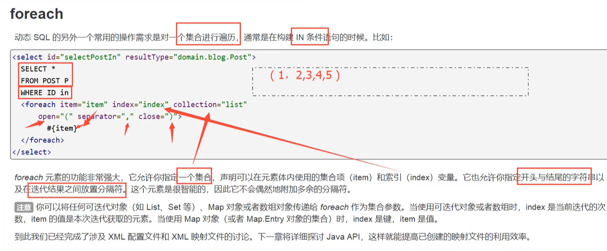

```xml
<foreach collection="操作的集合" item="每个元素" index="索引" open="开始的字符" separator="分割符" cloes="结束的字符">
	...
</foreach>
```

```xml
        select * from mybatis.blog
        <where>
            <trim prefix="title in">
                <foreach collection="list" item="title" open="(" separator="," close=")">
                    #{title}
                </foreach>
            </trim>

            <!-- 上下两个效果一样 -->
            
            <foreach collection="list" item="title" index="index" separator="or">
                title = #{title}
            </foreach>
        </where>
```

## 13、 缓存

### 13.1、 简介

```
查询 ： 链接数据库 ， 十分耗资源！
    一次查询的结果，给它暂存在一个可以直接取到的地方! --> 内存 ： 缓存
    
我们再次查询相同的数据的时候，直接走缓存，就不需要走数据库了！
```


1. 什么是缓存(Cache)?
   * 存在内存中的临时数据。
   * 将用户经常查询的数据放在缓存(内存)中，用户去查询数据就不用从磁盘上(关系型数据库数据文件)查询,从缓存中查询,从而提高查询效率,解决了高并发系统的性能问题。
2. 为什么使用缓存？
   * 减少和数据库的交互次数，减少系统开销，提高系统效率。
3. 什么样的数据才能使用缓存
   * 经常查询且不经常改变的数据。

### 13.2、 Mybatis缓存

* MyBatis包含一个非常强大的查询缓存特性, 它可以非常方便地定制和配置缓存。缓存可以极大的提升查询效
  率。
* MyBatis系统中默认定义了两级缓存: **一级缓存**和**二级缓存**
  * 默认情况下，只有一级缓存开启。 (SqISession级别的缓存， 也称为本地缓存)
  * 二级缓存需要手动开启和配置，他是基于namespace级别的缓存。
  * 为了提高扩展性, MyBatis定义了缓存接口Cache。我们可以通过实现Cache接口来自定义二级缓存

### 13.3、 一级缓存

* 一级缓存也叫本地缓存:
  * 与数据库同一次会话期间查询到的数据会放在本地缓存中。
  * 以后如果需要获取相同的数据，直接从缓存中拿，没必须再去查询数据库;

测试步骤：

1. 开始日志！

2. 测试在一个Session中查询两次相同记录

3. 查看日志输出

   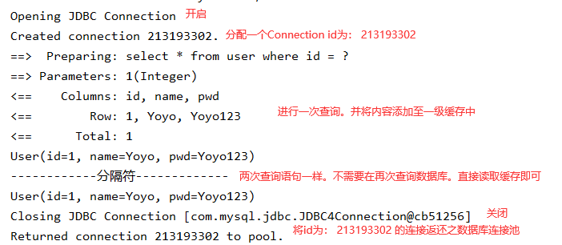

缓存失效的情况：

1. 查询不同的东西

2. 增删改操作，可能会改变原来的数据，所以必定会刷新缓存!

3. 查询不同的Mapper.xml

4. 手动清理缓存!

   ```java
   sqlSession.clearCache(); // 手动清理缓存
   ```

小结: 一级缓存默认是开启的，只在一次SqISession中有效, 也就是拿到连接到关闭连接这个区间段!

### 13.4、 二级缓存

* 二级缓存也叫全局缓存，一级缓存作用域太低了，所以诞生了二级缓存
* 基于namespace级别的缓存，一个名称空间，对应一个二级缓存;
* 工作机制
  * 一个会话查询一条数据,这个数据就会被放在当前会话的一-级缓存中;
  * 如果当前会话关闭了，这个会话对应的一级缓存就没了;但是我们想要的是，会话关闭了，一级缓存中的数据被保存到二级缓存中;
  * 新的会话查询信息，就可以从二级缓存中获取内容;
  * 不同的mapper查出的数据会放在自己对应的缓存(map) 中; .

步骤：

1. 开启全局缓存(mybatis-config.xml)

   ```xml
       <settings>
           <!-- 显式开启全局缓存。默认开启。增加可读性 -->
           <setting name="cacheEnabled" value="true"/>
       </settings>
   ```

2. 在要使用二级缓存的Mapper中开启(XxxMapper.xml)

   ```xml
   <!-- 在当前Mapper.xml中使用二级缓存 -->
   <cache/>
   	<!-- 或 -->
   <cache
     eviction="清除策略"
     flushInterval="刷新间隔"
     size="引用数目"
     readOnly="只读"/>
   
   <!-- 
   可用的清除策略有：
   LRU – 最近最少使用：移除最长时间不被使用的对象。
   FIFO – 先进先出：按对象进入缓存的顺序来移除它们。
   SOFT – 软引用：基于垃圾回收器状态和软引用规则移除对象。
   WEAK – 弱引用：更积极地基于垃圾收集器状态和弱引用规则移除对象。
   默认的清除策略是 LRU。
   
   flushInterval（刷新间隔）属性可以被设置为任意的正整数，设置的值应该是一个以毫秒为单位的合理时间量。 默认情况是不设置，也就是没有刷新间隔，缓存仅仅会在调用语句时刷新。
   
   size（引用数目）属性可以被设置为任意正整数，要注意欲缓存对象的大小和运行环境中可用的内存资源。默认值是 1024。
   
   readOnly（只读）属性可以被设置为 true 或 false。只读的缓存会给所有调用者返回缓存对象的相同实例。 因此这些对象不能被修改。这就提供了可观的性能提升。而可读写的缓存会（通过序列化）返回缓存对象的拷贝。 速度上会慢一些，但是更安全，因此默认值是 false。
   -->
   ```

   问题：

   * 我们需要将实体类序列化。否则就会报错！

   ```java
   Caused by: java.io.NotSerializableException: com.yh.pojo.User
   ```

   

小结：

* 只要开启了二级缓存，在同一个Mapper下就有效
* 所有的数据都会先放在一级缓存中; .
* 只有当会话提交,或者关闭的时候，才会提交到二级缓冲中!
*  二级缓存是事务性的。这意味着，当 SqlSession 完成并提交时，或是完成并回滚，但没有执行 flushCache=true 的 insert/delete/update 语句时，缓存会获得更新。 


### 13.5、 缓存原理

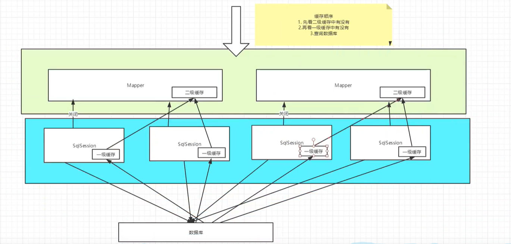

