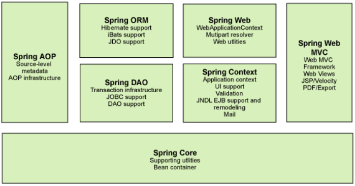
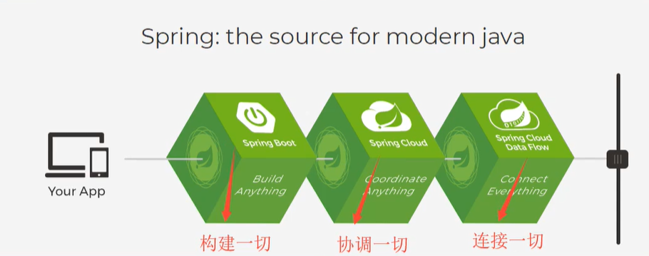
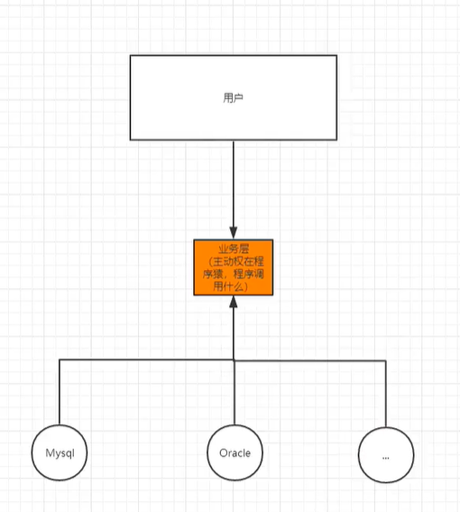
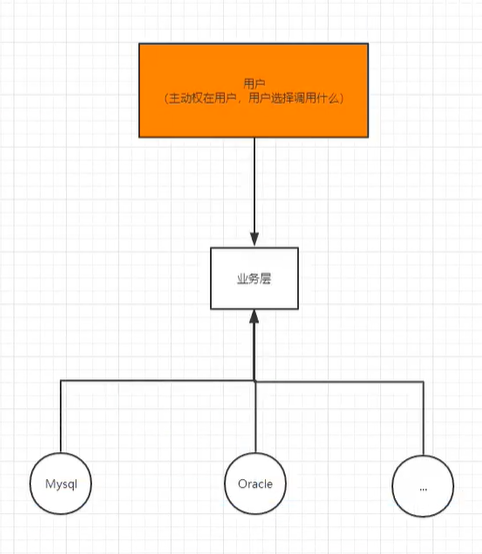
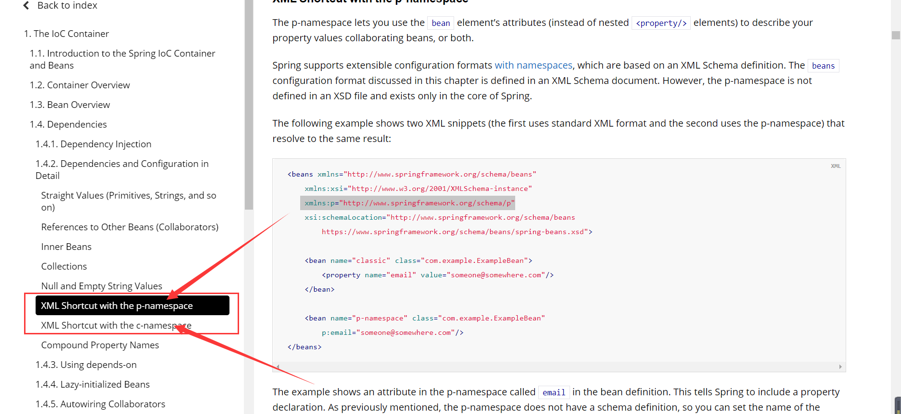
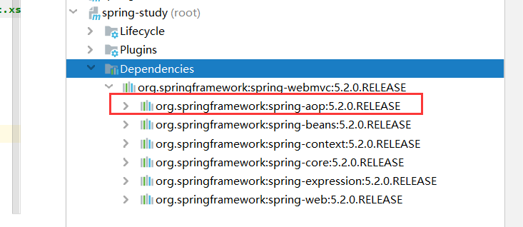
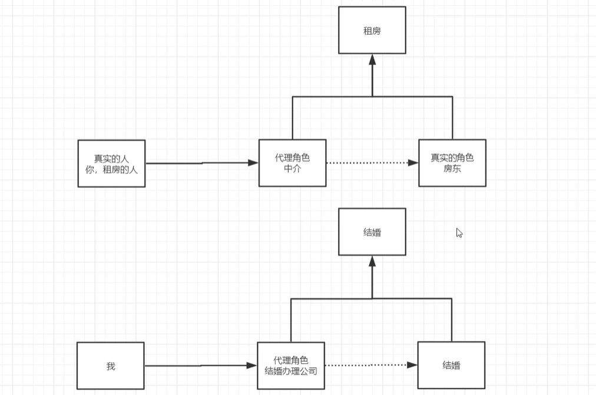
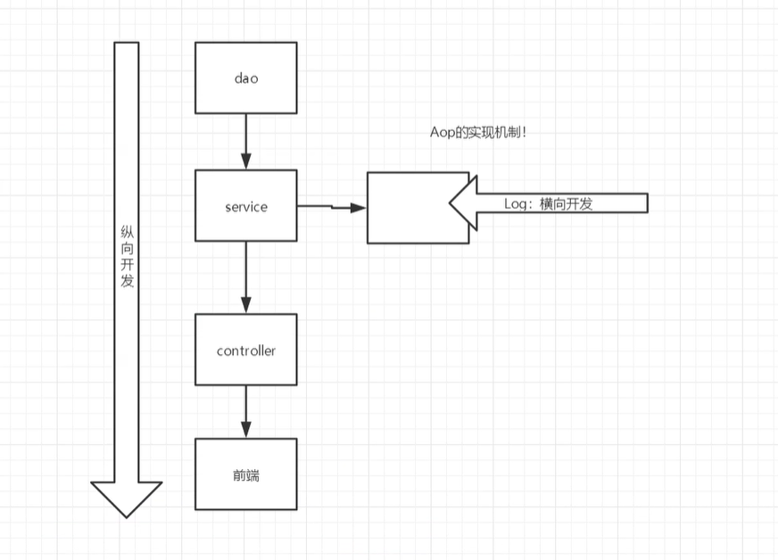
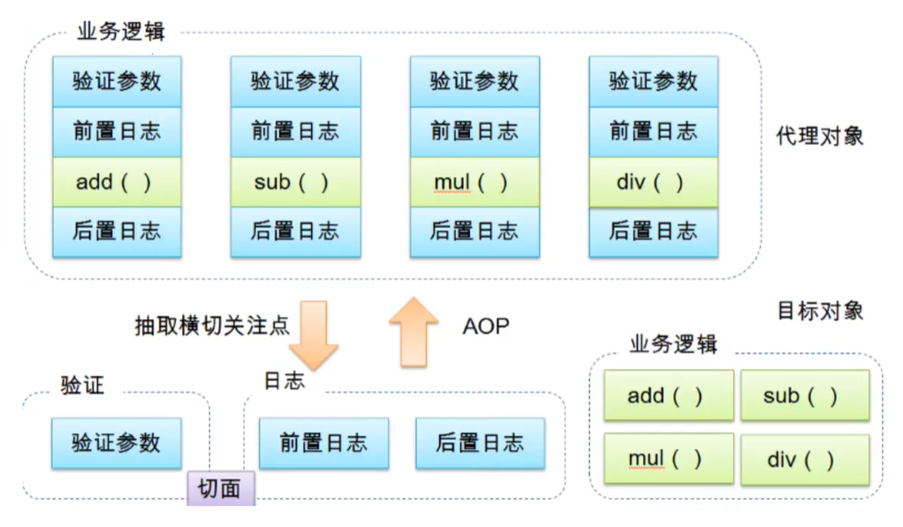
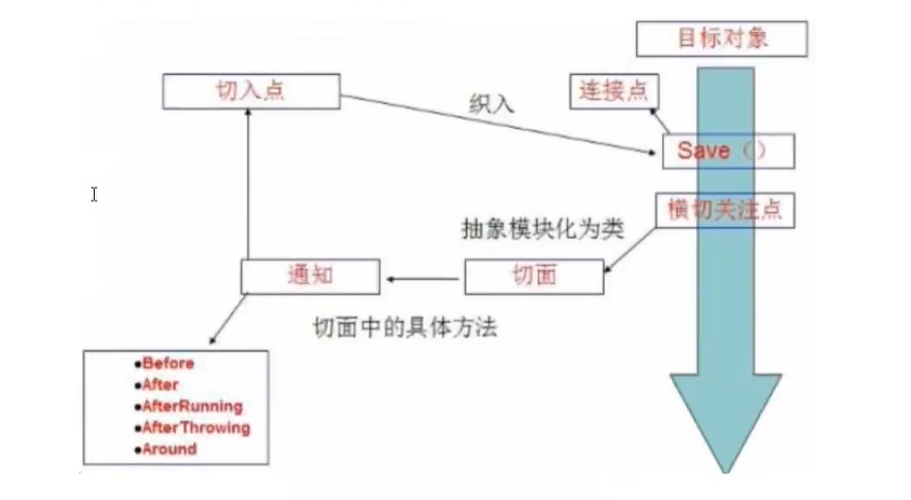

## 1、 Spring

帮助文档：  https://docs.spring.io/spring/docs/5.2.6.RELEASE/spring-framework-reference/ 

### 1.1、 简介

* Spring: 春---->给软件行业带来了春天!
* 2002， 首次推出了Spring框架的雏形: interface21框架!
* Spring框架即以interface21框架为基础，经过重新设计,并不断丰富其内涵,于2004年3月24日,发布了1.0正式版。
* Rod Johnson，Spring Framework创始人, 著名作者。很难想象Rod Johnson的学历， 真的让好多人大吃一惊，他是悉尼大学的博士，然而他的专业不是计算机，而是音乐学。
* spring理念:使现有的技术更加容易使用,本身是一个大杂烩。 整合了现有的技术!


* SSH : Struct2 + Spring + Hibernate!
* SSM : SpringMvc + Spring + Mybatis!


官网： https://spring.io/projects/spring-framework#overview

官方下载地址： http://repo.spring.io/release/org/springframework/spring

GitHub： http://repo.spring.io/release/org/springframework/spring


```xml
<dependency>
    <groupId>org.springframework</groupId>
    <artifactId>spring-webmvc</artifactId>
    <version>5.2.0.RELEASE</version>
</dependency>

<dependency>
    <groupId>org.springframework</ groupId>
    <artifactId>spring-jdbc</artifactId>
    <version>5.2.0.RELEASE</version>
</dependency>
```


### 1.2、 优点

* Spring是一个开源的免费的框架（容器）！
* Spring是一个轻量级的、非入侵式的框架！
* 控制反转(IOC)，面向切面(AOP)！
* 支持事物的处理，对框架整合的支持！


**==Spring就是一个轻量级的控制反转(IOC)面向切面编程(AOP)的框架！==**

### 1.3、  组成




### 1.4、 拓展

在Spring的官网有这个介绍:现代化的Java开发!说白就是基于Spring的开发!



* Spring Boot
  * 一个快速开发的脚手架。
  * 基于SpringBoot可以快速的开发单个微服务。
  * 约定大于配置!
* Spring Cloud
  * SpringCloud 是基于Spring Boot实现的。


因为现在大多数公司都在使用SpringBoot进行快速开发,学习SpringBoot的前提， 需要完全掌握Spring及SpringMVC！ 承上启下的作用！	


**弊端:发展了太久之后，违背了原来的理念!配置十分繁琐，人称:”配置地狱!”**

## 2、 IOC理论推导

1. UserDao接口
2. UserDaolmpl实现类
3. UserService业务接口
4. UserServicelmpl业务实现类


在我们之前的业务中，用户的需求可能会影响我们原来的代码，我们需要根据用户的需求去修改原代码!如果程序代码量十分庞大，修改一次的成本代价极其昂贵!



我们使用一个Set/构造接口实现，已经发生了革命性的变化！

```java
    private UserDao userDao;

    public UserServiceImpl() {
        this.userDao = new UserDaoDefaultImpl();
    }

    public UserServiceImpl(UserDao dao) {
        this.userDao = dao;
    }

    public void setUserDao(UserDao userdao) {
        this.userDao = userdao;
    }

    public void getUser() {
        userDao.getUser();
    }
```


* 之前，程序是主动创建对象!控制权在程序猿手上!
* 使用了set/构造注入后，程序不再具有主动性，而是变成了被动的接受对象!

这种思想，从本质上解决了问题，我们程序猿不用再去管理对象的创建了。系统的耦合性大大降低~，可以更加专注的在业务的实现上!这是IOC的原型!



### IOC本质

**控制反转loC(Inversion of Control)，是一种设计思想，DI(依赖注入)是实现IoC的一种方法**，也有人认为DI只是IoC的另一种说法。没有IoC的程序中,我们使用面向对象编程,对象的创建与对象间的依赖关系完全硬编码在程序中，对象的创建由程序自己控制，控制反转后将对象的创建转移给第三方，个人认为所谓控制反转就是:获得依赖对象的方式反转了。

采用XML方式配置Bean的时候，Bean的定 义信息是和实现分离的,而采用注解的方式可以把两者合为一体,Bean的定义信息直接以注解的形式定义在实现类中,从而达到了零配置的目的。

**控制反转是一种通过描述(XML或注解)并通过第三方去生产或获取特定对象的方式。在Spring中实现控制反转的是IoC容器，其实现方法是依赖注入(Dependency Injection,DI)。**

## 3、 HelloSpring

编写配置文件

```xml
<?xml version="1.0" encoding="UTF-8"?>
<beans xmlns="http://www.springframework.org/schema/beans"
       xmlns:xsi="http://www.w3.org/2001/XMLSchema-instance"
       xsi:schemaLocation="http://www.springframework.org/schema/beans
        https://www.springframework.org/schema/beans/spring-beans.xsd">

    <!-- 使用Spring来创建对象。在Spring这些都称为 Bean
        类型 变量名 = new 类型();
        Hello hello = new Hello();

        id = 遍历名。
        class = new 的对象。
        property 给对象中的属性设置一个值。
            value 基本类型。  ref Spring中的引用id
     -->
    <bean id="hello" class="com.yh.pojo.Hello">
        <property name="str" value="Spring"/>
    </bean>


</beans>
```

创建对应的类

```java
public class Hello {
    private String str;

    public String getStr() {
        return str;
    }

    public void setStr(String str) {
        this.str = str;
    }

    @Override
    public String toString() {
        return "Hello{" +
                "str='" + str + '\'' +
                '}';
    }
}
```

测试

```java
    public static void main(String[] args) {
        // 解析 beans.xml文件。 生产管理相应的Bean对象
        ApplicationContext context = new ClassPathXmlApplicationContext("beans.xml");
		// getBean：参数即为spring配置文件中bean的id
//        Hello bean = (Hello) context.getBean("hello");
//        System.out.println(bean);

        Hello bean1 = context.getBean(Hello.class);
        System.out.println(bean1);
    }
```

### 思考问题

* Hello对象是谁创建的?
  	hello对象是由Spring创建的	
* Hello对象的属性是怎么设置的?
  	hello对象的属性是由Spring容器设置的,

这个过程就叫控制反转：

控制:谁来控制对象的创建，传统应用程序的对象是由程序本身控制创建的,使用Spring后,对象是由Spring来创建的.

反转:程序本身不创建对象,而变成被动的接收对象.

依赖注入:就是利用set方法来进行注入的.

IOC是一种编程思想,由主动的编程变成被动的接收.

可以通过newClassPathXmlApplicationContext去浏览一下底层源码 .

**我们彻底不用再程序中去改动了,要实现不同的操作,只需要在xml配置文件中进行修改,所谓的
lOC,一句话搞定:对象由Spring来创建,管理,装配!**

## 4、 IOC创建对象的方式

1. 使用无参构造创建对象，默认!

2. 假设我们要使用有参构造创建对象。

   ```xml
       <!-- 方式1： index 下标 -->
       <bean id="user" class="com.yh.pojo.User">
           <constructor-arg index="0" value="Spring"/>
       </bean>
   ```

   ```xml
       <!-- 方式2： type 数据类型  不常用 -->
       <bean id="user" class="com.yh.pojo.User">
           <constructor-arg type="java.lang.String" value="Spring"/>
       </bean>
   ```

   ```xml
       <!-- 方式3： name 属性名称 -->
       <bean id="user" class="com.yh.pojo.User">
           <constructor-arg name="name" value="Spring"/>
       </bean>
   ```

总结：在配置文件加载的时候，容器中管理的对象就已经初始化了！且只有一份

​	证实：

```java
    public static void main(String[] args) {
        ApplicationContext context = new ClassPathXmlApplicationContext("beans.xml");
        User user = (User) context.getBean("user");
        User user1 =  (User) context.getBean("user");
        System.out.println(user == user1);
    }

	console:
		User已被构建成功
        UserT 已被构成成功		// 没有手动去获取UserT Spring将xml中的所有对象都创建一个对象
        true					// 获取两个相同的bean则两个相同。 同一个类。不同的bean则不相等。 结论： 一个bean创建一个对象。多次获取也是同一个(默认，可以通过配置文件配置)。
```

## 5、 Spring配置


### 5.1、 别名

```xml
    <!-- 别名、如果添加了别名，我们就可以使用别名来获取到这个对象 （可以创建对各。对象相同）-->
    <alias name="user" alias="userNew"/>
    <alias name="user" alias="userNew1"/>
    <alias name="userNew" alias="userNew2"/>
```

### 5.2、 Bean配置

```xml
    <!--
        id： bean 的唯一标识符，也就是相等于我们学的变量名
        class： bean 对象所对应的全限定名： 包名 + 类型
        name： 也是别名，name也可以同时取多个别名 分隔符：  空格 , ;
     -->
    <bean id="user" class="com.yh.pojo.User" name="user2 u2,u3;u4">
        <property name="name" value="Spring"/>
    </bean>
```

### 5.3、 import

这个import, 一般用于团队开发使用,他可以将多个配置文件,导入合并为一个

假设,现在项目中有多个人开发,这三个人复制不同的类开发，不同的类需要注册在不同的bean中，我们可以利用import将所有人的beans.xml合并为一个总的!

* 张三

* 李四

* 王五

* applicationContext.xml

  ```xml
  <import resources="beans1.xml"/>
  <import resources="beans2.xml"/>
  <import resources="beans3.xml"/>
  ```

使用的时候，直接使用总的配置就可以了

## 6、 依赖注入

### 6.1、 构造器注入

在**4、 IOC创建对象**的方式中已经说明


### 6.2、 Set方式注入 【重点】

* 依赖注入： Set注入！
  * 依赖: bean对象的创建依赖于容器!
  * 注入: bean对象中的所有属性, 由容器来注入! 


【环境搭建】

1. 复杂类型

   ```java
   public class Address {
       private String address;
       get/set 省略
   }
   ```

2. 真实测试对象

   ```java
   public class Student {
       private String name;
       private Address address;
       private String[] books;
       private List<String> hobbys;
       private Map<String ,String> card;
       private Set<String> games;
       private String wife;
       private Properties info;
   	get/set 省略
   }
   ```

3. applicationContext.xml

   ```xml
   <?xml version="1.0" encoding="UTF-8"?>
   <beans xmlns="http://www.springframework.org/schema/beans"
          xmlns:xsi="http://www.w3.org/2001/XMLSchema-instance"
          xsi:schemaLocation="http://www.springframework.org/schema/beans
           https://www.springframework.org/schema/beans/spring-beans.xsd">
   
       <bean id="address" class="com.yh.pojo.Address">
           <property name="address" value="北方"/>
       </bean>
   
       <bean name="student" class="com.yh.pojo.Student">
           <!-- 基本类型注入 value -->
           <property name="name" value="Jack"/>
           <!-- Bean（引用）注入 ref -->
           <property name="address" ref="address"/>
           <!-- 数组注入 -->
           <property name="books">
               <array>
                   <value>Mybatis</value>
                   <value>Maven</value>
                   <value>Spring</value>
               </array>
           </property>
           <!-- List注入 -->
           <property name="hobbys">
               <list>
                   <value>听歌</value>
                   <value>代码</value>
                   <value>电影</value>
               </list>
           </property>
           <!-- Map注入 -->
           <property name="card">
               <map>
                   <entry key="身份证" value="123456789123"/>
                   <entry key="手机号" value="123456789"/>
               </map>
           </property>
           <!-- null值 -->
           <property name="wife">
               <null/>
           </property>
           <!-- Set注入 -->
           <property name="games">
               <set>
                   <value>LOL</value>
                   <value>COC</value>
                   <value>BBQ</value>
               </set>
           </property>
           <property name="info">
               <props>
                   <prop key="id">001</prop>
                   <prop key="sex">男</prop>
                   <prop key="name">Jack</prop>
               </props>
           </property>
       </bean>
   
   
   </beans>
   ```

4. 输出结果

   ```java
   Student{
       name='Jack',
       address=Address{
           address='北方'
       }, 
       books=[Mybatis, Maven, Spring],
       hobbys=[听歌, 代码, 电影],
       card={
           身份证=123456789123,
           手机号=123456789
       },
       games=[LOL, COC, BBQ],
       wife='null',
       info={
          	name=Jack,
         	sex=男,
          	id=001
       }
   }
   
   ```

   

### 6.3、 扩展方式注入

我们可以使用p命令空间和c命令空间进行注入
官方解释:




使用

```xml
<?xml version="1.0" encoding="UTF-8"?>
<beans xmlns="http://www.springframework.org/schema/beans"
       xmlns:p="http://www.springframework.org/schema/p"
       xmlns:c="http://www.springframework.org/schema/c"
       xmlns:xsi="http://www.w3.org/2001/XMLSchema-instance"
       xsi:schemaLocation="http://www.springframework.org/schema/beans
        https://www.springframework.org/schema/beans/spring-beans.xsd">
		
    	<!--p命名空间注入，可以直按注入属性的值: property-->
		<bean id="user" class="com.kuang.pojo.User" p:name="yh" p:age="18"/>
		                                                                      				<!--c命名空间注入，通过构造器注入: construct-args-->
		<bean id="user2" class="com.kuang.pojo.User" c:age="18" c:name="yoyo"/>
</beans>
```

注意点: p命名和c命名空间不能直接使用，需要导入xml约束!

```xml
p :  xmlns:p="http://www.springframework.org/schema/p"
c :  xmlns:c="http://www.springframework.org/schema/c"
```

### 6.4、 bean的作用域

| Scope                                                        | Description                                                  |
| :----------------------------------------------------------- | :----------------------------------------------------------- |
| [singleton](https://docs.spring.io/spring/docs/5.2.6.RELEASE/spring-framework-reference/core.html#beans-factory-scopes-singleton) | (Default) Scopes a single bean definition to a single object instance for each Spring IoC container. |
| [prototype](https://docs.spring.io/spring/docs/5.2.6.RELEASE/spring-framework-reference/core.html#beans-factory-scopes-prototype) | Scopes a single bean definition to any number of object instances. |
| [request](https://docs.spring.io/spring/docs/5.2.6.RELEASE/spring-framework-reference/core.html#beans-factory-scopes-request) | Scopes a single bean definition to the lifecycle of a single HTTP request. That is, each HTTP request has its own instance of a bean created off the back of a single bean definition. Only valid in the context of a web-aware Spring `ApplicationContext`. |
| [session](https://docs.spring.io/spring/docs/5.2.6.RELEASE/spring-framework-reference/core.html#beans-factory-scopes-session) | Scopes a single bean definition to the lifecycle of an HTTP `Session`. Only valid in the context of a web-aware Spring `ApplicationContext`. |
| [application](https://docs.spring.io/spring/docs/5.2.6.RELEASE/spring-framework-reference/core.html#beans-factory-scopes-application) | Scopes a single bean definition to the lifecycle of a `ServletContext`. Only valid in the context of a web-aware Spring `ApplicationContext`. |
| [websocket](https://docs.spring.io/spring/docs/5.2.6.RELEASE/spring-framework-reference/web.html#websocket-stomp-websocket-scope) | Scopes a single bean definition to the lifecycle of a `WebSocket`. Only valid in the context of a web-aware Spring `ApplicationContext`. |

1. 单例模式 (Spring默认机制)

   ```xml
   <bean id="user" class="com.yh.pojo.User" scope="singleton"/>
   ```

2. 原型模式:每次从容器中get的时候，都会产生一个新对象!

   ```xml
   <bean id="user" class="com.yh.pojo.User" scope="prototype"/>
   ```

3. 其余的request、session、 application、 这些个只能在web开发中使用到!

## 7、 Bean的自动装配

* 自动装配是Spring满足bean依赖一种方式!
* Spring会在上下文中自动寻找，并自动给bean装配属性!


在Spring中的三种装备的方式

1. 在xml中显示的配置
2. 在java中显示配置
3. 隐式的自动装配bean [重要]


一个人有两个宠物

```java
public class Person {
    private String name;
    private Cat cat;
    private Dog dog;
	get/set 省略
}
```


### 7.1、 byName

```xml
    <bean id="cat" class="com.yh.pojo.Cat"/>
    <bean id="dog" class="com.yh.pojo.Dog"/>
    <!-- 会自动在容器上下文中查找，和自己对象set方法后面的值对应的bean id -->
    <bean id="person" class="com.yh.pojo.Person" autowire="byName">
        <property name="name" value="Yoyo"/>
    </bean>
```

### 7.2、 byType

```xml
    <bean id="cat" class="com.yh.pojo.Cat"/>
    <bean id="dog" class="com.yh.pojo.Dog"/>
	<!-- 会自动在容器上下文中查找，和自己对象属性类型对同的bean -->
    <bean id="person" class="com.yh.pojo.Person" autowire="byType">
        <property name="name" value="Yoyo"/>
    </bean>
```


小结:

* byname的时候，需要保证所有bean的id唯一 ， 并且这个bean需要和自动注入的属性的set方法的值一致!
* bytype的时候，需要保证所有bean的class唯一,并且这个bean需要和自动注入的属性的类型一致!

### 7.3、 使用注解实习自动装配

jdk1 .5支持的注解, Spring2.5就支持注解了! .

The introduction of annotation-based configuration raised the question of whether this approach is "better"than XML.

要使用注解须知：

1. 导入约束	: context

2. ==配置注解的支持 : \<context:annotation-config/\>==

   ```xml
   <?xml version="1.0" encoding="UTF-8"?>
   <beans xmlns="http://www.springframework.org/schema/beans"
       xmlns:xsi="http://www.w3.org/2001/XMLSchema-instance"
       xmlns:context="http://www.springframework.org/schema/context"
       xsi:schemaLocation="http://www.springframework.org/schema/beans
           https://www.springframework.org/schema/beans/spring-beans.xsd
           http://www.springframework.org/schema/context
           https://www.springframework.org/schema/context/spring-context.xsd">
   
       <context:annotation-config/>
   
   </beans>
   ```


**@Autowired**

直接在属性上使用即可!也可以在set方式上使用!

```java
public class Person {
    private String name;
    @Autowired
    private Cat cat;
    @Autowired
    private Dog dog;
    get/set 忽略
}
```

```xml
    <bean id="cat" class="com.yh.pojo.Cat"/>
    <bean id="dog" class="com.yh.pojo.Dog"/>

    <bean id="person" class="com.yh.pojo.Person">
        <property name="name" value="Yoyo"/>
    </bean>
```


使用Autowired我们可以不用编写Set方法了，前提是你这个自动装配的属性在IOC (Spring) 容器中存在，且符合名字byname!

科普:

```xml
@Nullable 字段/参数标记了这个注解，说明这个字段可以为nu11;
```

```java
pub1ic @interface Autowired {
    boolean required() default true;
}

//如果显示定义了Autowired的required属性为false，说明这个对象可以为nu1l，否则不允许为空
@Autowired(required = false)
```


如果@Autowired自动装配的环境比较复杂，自动装配无法通过一个注解[@Autowired] 完成的时候、我们可以使用@Qualifier("xx")去配置@Autowired的使用，指定一个唯一的bean对象注入!

```java
public class Person {
    private String name;
    @Autowired
    @Qualifier("cat2")
    private Cat cat;
    @Autowired
    @Qualifier("dog1")
    private Dog dog;
	get/set 忽略
}
```

```xml
    <bean id="cat1" class="com.yh.pojo.Cat"/>
    <bean id="cat2" class="com.yh.pojo.Cat"/>
    <bean id="dog1" class="com.yh.pojo.Dog"/>
    <bean id="dog2" class="com.yh.pojo.Dog"/>

    <bean id="person" class="com.yh.pojo.Person">
        <property name="name" value="Yoyo"/>
    </bean>
```


**@Resource注解**

```java
public class Person {

    private String name;
    @Resource(name = "cat1")
    private Cat cat;

    @Resource(name = "dog1")
    private Dog dog;
	get/set 忽略
}
```

```xml
    <bean id="cat1" class="com.yh.pojo.Cat"/>
    <bean id="cat2" class="com.yh.pojo.Cat"/>
    <bean id="dog1" class="com.yh.pojo.Dog"/>
    <bean id="dog2" class="com.yh.pojo.Dog"/>

    <bean id="person" class="com.yh.pojo.Person">
        <property name="name" value="Yoyo"/>
    </bean>
```

```java
public class Person {

    private String name;
    @Resource
    private Cat cat;

    @Resource
    private Dog dog;
	get/set 忽略
}
```

```xml
    <bean id="cat" class="com.yh.pojo.Cat"/>
    <bean id="dog" class="com.yh.pojo.Dog"/>

    <bean id="person" class="com.yh.pojo.Person">
        <property name="name" value="Yoyo"/>
    </bean>
```


小结：

@Resource和@ Autowired的区别:

* 都是用来自动装配的，都可以放在属性字段上
* @ Autowired通过byType的方式实现,而且必须要求这个对象存在! [常用]
* @ Resource默认通过byname的方式实现，如果找不到名字,则通过byType实现!如果两个都找不到的情况下，就报错! 
* 执行顺序不同: @ Autowired通过byType的方式实现。@ Resource默认通过byname的方式实现。

## 8、使用注解开发

在Spring4之后，要使用注解开发,必须要保证aop的包导入了



使用注解需要导入context约束。增加注解的支持！

```xml
<?xml version="1.0" encoding="UTF-8"?>
<beans xmlns="http://www.springframework.org/schema/beans"
       xmlns:xsi="http://www.w3.org/2001/XMLSchema-instance"
       xmlns:context="http://www.springframework.org/schema/context"
       xsi:schemaLocation="http://www.springframework.org/schema/beans
        https://www.springframework.org/schema/beans/spring-beans.xsd
        http://www.springframework.org/schema/context
        https://www.springframework.org/schema/context/spring-context.xsd">

    <context:annotation-config/>

</beans>
```


1. bean

   @Component ;组件，放在类上，说明这个类被Spring管理了，就是bean!

2. 属性如何注入

   @Value("xxx") 在属性上/set方法上（后执行）。 繁琐的还是使用xml	

3. 衍生的注解;

   @Component有几个衍生注解,我们在web开发中,会按照mvc三层架构分层!

   - dao [@Repository]

   - service [@Service]

   - controller [ @Controller]

     这四个注解功能都是一样的，都是代表将某个类注册到Spring中,装配Bean

4. 自动装配置

   @Autowired :自动装配通过类型。名字
   		如果Autowi red不能唯一自动装配上属性，则需要通过@Qualifier("xxx")

   @Nullab1e ： 字段标记了这个注解，说明这个字段可以为nu11; 

   @Resource ：自动装配通过名字。类型。

5. 作用域

   @Scope("xxx") 

6. 小结

   xml与注解:

   - xml更加万能，适用于任何场合!维护简单方便
   - 注解不是自己类使用不了，维护相对复杂!

   xml与注解最佳实践:

   - xml用来管理bean;

   - 注解只负责完成属性的注入;

   - 我们在使用的过程中，只需要注意-个问题:必须让注解生效，就需要开启注解的支持

     ```xml
     <!--指定要扫描的包，这个包下的注解就会生效-->
     <context :component-scanbase-package="com.yh"/>
     <context : annotation-config/>
     ```

     

## 9、 使用Java的方式配置Spring

我们现在要完全不使用Spring的xml配置了，全权交给Java来做!

JavaConfig是Spring的一个子项目,在Spring 4之后,它成为了一个核心功能!

如果完全使用配置类方式去做，我们就只能通过AnnotationConfig上下文来获取容器，通过配置类的class对象加载!

```java
ApplicationContext context = new AnnotationConfigApplicationContext(JavaConfig.class);
```


@Configuration

```java
@Configuration
public class JavaConfig {
    /*
    	会被Spring容器托管， 注册到容器中，因为他本米就是一个@Component， 
    	@Configuration代表这是一个配置类，就和我们之前看的applicationContext.xml
     */
	...
}
```

@componentScan("") 

```java
@Configuration
@ComponentScan("com.yh")
public class JavaConfig {
    /*
    	等同于在applicationContext.xml 中使用 <context:component-scan base-package="com.yh"/>  扫描包
     */
	...
}
```

@Bean

```java
@Configuration
@ComponentScan("com.yh")
public class JavaConfig {
    
    @Bean
    public User user(){
        return new User();
    }
    /*
   		等同于在applicationContext.xml 中使用 注册一个bean标签。
      	在@Configuration修饰的类中出现。	
      		方法的名字，就相当于bean标签中的id属性
			方法的返回值，就相当于bean标签中的class属性
            方法体就是要注入到bean中的对象
     */
}
```

@Import(Class clazz); 	相等于在配置文件中使用import 标签。引用其他的配置文件。

```java
@Configuration
@ComponentScan("com.yh")
@Import(JavaConfig.class)
public class JavaConfig {
    /*
  		等同于在applicationContext.xml 中使用 import标签。
  		去引用其他配置类的信息。
     */
}
```

测试类

```java
public static void main(String[] args) {
	ApplicationContext context = new 						
        AnnotationConfigApplicationContext(JavaConfig.class);
    User user = (User) context.getBean("user");
    System.out.println(user);
}
```


这种纯Java的配置方式，在SpringBoot中随处可见!

## 10、 代理模式

为什么要学习代理模式?因为这就是SpringAOP的底层!        [面试必问SpringAOP 和SpringMVC] 

代理模式的分类:

- 静态代理
- 动态代理



### 10.1、 静态代理

角色分析：

- 抽象角色:一般会使用接口或者抽象类来解决
- 真实角色:被代理的角色
- 代理角色:代理真实角色，代理真实角色后，我们一般会做一-些附属操作
- 客户:访问代理对象的人!


代码步骤：

1. 接口

   ```java
   // 出租房屋
   public interface Rent {
       public void rent();
   }
   ```

2. 真实角色

   ```java
   // 房东
   public class Host implements Rent {
       public void rent(){
           // 租房详情
       }
   }
   ```

3. 代理角色

   ```java
   // 中介
   public class Proxy implements Rent {
       private Host host;
       public Proxy(){}
       public Proxy(Host host){
           this.host = host;
       }
       // 代理出租方法。
       public void rent(){
           this.seeHouse();
           host.rent();
           this.fare();
       }
       public void seeHouse(){
           // 看房详情
       }
       public void fare(){
           // 收取中介费用
       }
   }
   ```

4. 客户端访问代理角色

   ```java
   public static void main(String[] rags) {
       // 房东
       Host host = new Host();
       // 代理  代理一般会有一些附属操作。 如看房等等
       Proxy proxy = new Porxy();
       // 不需要直接面对房东。找中介即可。	
       proxy.rent();
   }
   ```

   

代理模式的好处：

- 可以使真实角色的操作更加纯粹!不用去关注一些公共的业务
- 公共也就就交给代理角色!实现了业务的分工!
- 公共业务发生扩展的时候，方便集中管理! .

缺点：

- 个真实角色就会产生一个代理角色;代码量会翻倍开发效率会变低~


聊聊AOP



### 10.2、 动态代理

- 动态代理和静态代理角色一样
- 动态代理的代理类是动态生成的,不是我们直接写好的!
- 动态代理分为两大类:基于接口的动态代理，基于类的动态代理
  - 基于接口--- JDK动态代理[ 我们在这里使用]
  - 基于类: cglib .
  - java字节码实现: javasist


需要了解两个类: Proxy: 代理，InvocationHandler: 调用处理程序

```java
public class InvocationHandlerProxy<T> implements InvocationHandler {
	// 要被代理的类
    private T target;
	// 为要代理的类赋值
    public void setTarget(T target){
        this.target = target;
    }
	// 获取要代理的类
    public T newInstance(){
        return (T) Proxy.newProxyInstance(this.getClass().getClassLoader(),
                target.getClass().getInterfaces(), this);
    }
	// 执行方法
    public Object invoke(Object proxy, Method method, Object[] args) throws Throwable {
        this.start();
        Object result =  method.invoke(target, args);
        this.end();
        return result;
    }
	// 附加操作
    private void start() {
        System.out.println("method start...");
    }
	// 附加操作
    private void end() {
        System.out.println("method end...");
    }
}
```


动态代理的好处：

- 可以使真实角色的操作更加纯粹!不用去关注一些公共的业务
- 公共也就就交给代理角色!实现了业务的分工!
- 公共业务发生扩展的时候，方便集中管理!
- 一个动态代理类代理的是一个接口，一般就是对应的一类业务
- 一个动态代理类可以代理多个类,只要是实现了同一一个接口即可!

## 11、 AOP

### 11.1、 什么是AOP

AOP (Aspect Oriented Programming)意为:面向切面编程,通过预编译方式和运行期动态代理实现程序功能的统一维护的一种技术。AOP是0OP的延续，是软件开发中的一个热点， 也是Spring框架中的一个重要内容， 是函数式编程的一种衍生范型。利用AOP可以对业务逻辑的各个部分进行隔离，从而使得业务逻辑各部分之间的耦合度降低，提高程序的可重用性,同时提高了开发的效率。



### 11.2、 Aop在Spring中的作用

==提供声明式事物，允许用户自定义切面==

- 横切关注点:跨越应用程序多个模块的方法或功能。即是,与我们业务逻辑无关的，但是我们需要关注的部分，就是横切关注点。如日志,安全,缓存,事务等等...
- 切面(ASPECT) :横切关注点被模块化的特殊对象。即，它是一个类。
- 通知(Advice) :切面必须要完成的工作。即，它是类中的一个方法。
- 目标(Target) : 被通知对象。
- 代理(Proxy) :向目标对象应用通知之后创建的对象。
- 切入点(PointCut) :切面通知执行的“地点"的定义。
- 连接点JointPoint) :与切入点匹配的执行点。



SpringAOP中，通过Advice定义横切逻辑，Spring中支持5种类型的Advice:

| 通知类型     | 连接点               | 实现接口                                         |
| ------------ | -------------------- | ------------------------------------------------ |
| 前置通知     | 方法前               | org.springframework.aop.MethodBeforeAdvice       |
| 后置通知     | 方法结束之后         | org.springframework.aop.AfterReturningAdvice     |
| 环绕通知     | 方法前后             | org.aopalliance.intercept.MethodInterceptor      |
| 异常抛出通知 | 方法抛出异常         | org.springframework.aop.ThrowsAdvice             |
| 引介通知     | 类种增加新的方法通知 | org.springframework .aop.IntroductionInterceptor |

即Aop在不改变原有代码的情况下,去增加新的功能.

### 11.3、 使用Spring实现AOP

[重点]使用AOP织入,需要导入一个依赖包!

```xml
<dependency>
    <groupId>org.aspectj</groupId>
    <artifactId>aspectjweaver</artifactId>
    <version>1.9.4</version>
</dependency>
```

需要在applicationContext.xml中配置

```xml
<?xml version="1.0" encoding="UTF-8"?>
<beans xmlns="http://www.springframework.org/schema/beans"
       xmlns:xsi="http://www.w3.org/2001/XMLSchema-instance"
	   xmlns:context="http://www.springframework.org/schema/context"
       xmlns:aop="http://www.springframework.org/schema/aop"
       xsi:schemaLocation="http://www.springframework.org/schema/beans        					https://www.springframework.org/schema/beans/spring-beans.xsd
		    http://www.springframework.org/schema/context	
            https://www.springframework.org/schema/context/spring-context.xsd
            http://www.springframework.org/schema/aop
	        https://www.springframework.org/schema/aop/spring-aop.xsd">
    
    <!-- 方式1：使用原生Spring API接口 -->
    <!-- 配置aop: 需要导入aop的约束 -->
    <aop:config>
    	<!-- 切入点：expression 	
			表达式：execution(要执行的位置) 格式：[修饰符]  返回值 类名.方法名(参数)  *：任意
		-->
        <aop:pointcut id="id" expression="execution(* com.yh.service.UserServiceImpl.*(..))"/>	<!-- (..) 任意的参数 -->
        
        <!-- 执行增加 -->
        <!-- advice-ref:执行切入的操作。  pointcut-ref：切入的位置 -->
        <aop:advisor advice-ref="BeanId" pointcut-ref="PointcutId"/>
    </aop:config>
	
    
    <!-- 方式2：使用的主要是切面定义 (没有方式1的功能强大) -->
    <aop:config>
        <!-- 切入点 -->
        <aop:pointcut id="id" expression="execution(同方式1)"/>
    	<!-- 自定义切面，ref要引用的切面类 -->
		<aop:aspect ref="beanId">
            <!-- 通知 -->
            <!-- aop:执行的位置 。 method="执行的方法" pointcut-ref="pointcut的id" -->
			<aop:before method="methodName" pointcut-ref="pointcutId"/>
			<aop:after method="methodName" pointcut-ref="pointcutId"/>
        </aop:aspect>
    </aop:config>
    
    <!-- 方式三 使用注解 -->
   	<!-- 将注解AOP的类加载到容器中 -->
    <bean id="id" class="AnnotationAop"/> 
    <!-- 开启注解支持 JDK(默认 proxy-target-class="false") cglib(proxy-target-class="true") -->
    <a:aspectj-autoproxy proxy-target-class="false"/>
</beans>
```

接口

```java
public interface UserService {
    void add();
    void query();
    void alter();
    void remove();
}
```

实现类

```java
public class UserServiceImp1 implements UserService {
    public void add() {
        System.out.println("add");
   }

    public void query() {
        System.out.println("query");
    }

    public void alter() {
        System.out.println("alter");
    }

    public void remove() {
        System.out.println("remove");
    }
}
```

#### 方式1：原生Spring切面操作

AOP操作。切入操作

Before：之前

```java
public class BeforeAdvice implements MethodBeforeAdvice {
    public void before(Method method, Object[] objects, Object o) throws Throwable {
        System.out.println(new Timestamp(System.currentTimeMillis()) + "：" + 
            o.getClass().getName() + "的" + method.getName() + "被执行了");
    }
}
```

After：之后

```java
public class AfterAdvice implements AfterReturningAdvice {
    public void afterReturning(Object o, Method method, Object[] objects, Object o1) throws Throwable {
        System.out.println(method.getName() + "方法执行完毕， 返回值为" + o);
    }
}
```

applicationContext.xlm

```xml
<?xml version="1.0" encoding="UTF-8"?>
<beans xmlns="http://www.springframework.org/schema/beans"
       xmlns:a="http://www.springframework.org/schema/aop"
       xmlns:xsi="http://www.w3.org/2001/XMLSchema-instance"
       xsi:schemaLocation="http://www.springframework.org/schema/beans
        https://www.springframework.org/schema/beans/spring-beans.xsd
        http://www.springframework.org/schema/aop
        https://www.springframework.org/schema/aop/spring-aop.xsd">
	
    <bean id="userService" class="com.yh.service.UserServiceImp1"/>
    <bean id="beforeAdvice" class="com.yh.log.BeforeAdvice"/>
    <bean id="afterAdvice" class="com.yh.log.AfterAdvice"/>

    <a:config>
      <a:pointcut id="userServiceImpl" expression="execution(public void com.yh.service.UserServiceImp1.*(..))"/>
        <!-- 同一个操作。通过一个切入点可以多次插入相同的操作 -->
        <a:advisor advice-ref="afterAdvice" pointcut-ref="userServiceImpl"/>
        <a:advisor advice-ref="afterAdvice" pointcut-ref="userServiceImpl"/>
        <a:advisor advice-ref="beforeAdvice" pointcut-ref="userServiceImpl"/>
    </a:config>

</beans>
```

#### 方式2： 自定义切面类

AOP操作。切入操作

```java
public class diyAspect {

    public void after(){
        System.out.println("=============后===============");
    }
    public void before(){
        System.out.println("=============前==============");
    }

}
```

applicationContext.xml

```xml
<?xml version="1.0" encoding="UTF-8"?>
<beans xmlns="http://www.springframework.org/schema/beans"
       xmlns:aop="http://www.springframework.org/schema/aop"
       xmlns:xsi="http://www.w3.org/2001/XMLSchema-instance"
       xsi:schemaLocation="http://www.springframework.org/schema/beans
        https://www.springframework.org/schema/beans/spring-beans.xsd
        http://www.springframework.org/schema/aop
        https://www.springframework.org/schema/aop/spring-aop.xsd">

    <bean id="userService" class="com.yh.service.UserServiceImp1"/>
    <bean id="diy" class="com.yh.diyaspect.diyAspect"/>
    
    <aop:config>
        <aop:pointcut id="pointcut" expression="execution(* 			
        	com.yh.service.UserServiceImp1.*(..))"/>
        <aop:aspect ref="diy">
            <aop:after method="after" pointcut-ref="pointcut"/>
            <aop:before method="before" pointcut-ref="pointcut"/>
        </aop:aspect>
    </aop:config>

</beans>
```

#### 方式3： 使用注解

AOP操作。切入操作

```java
@Aspect
public class AnnotationPointCut {
    /*
        使用注解方式实现AOP

        注解：
            @Aspect  : 标记这个类为切面类
            @Before("execution表达式")  : 在方法执行前插入execution指定的切入位置
            @After("execution表达式")   ： 在方法执行后插入execution指定的切入位置
            @Around("execution表达式")  ： 环绕。可以分别指定前后。

        执行顺序：@Around前 -> @Before -> @Around执行方法 -> @Around后 -> @After
     */


    @Before("execution(* com.yh.service.UserServiceImp1.*(..))")
    public void before(){
        System.out.println("===========before============");
    }

    @After("execution(* com.yh.service.UserServiceImp1.*(..))")
    public void after(){
        System.out.println("=============after===========");
    }

    // 在环绕增强中，我们可以给定一个参数，代表我们要获取处理切入的点 ProceedingJoinPoint
    @Around("execution(* com.yh.service.UserServiceImp1.*(..))")
    public void around(ProceedingJoinPoint jp) throws Throwable {
        System.out.println("环绕前");

        System.out.println(jp.getSignature());// 获取签名 执行方法的详细信息
        System.out.println(jp.getThis().getClass().getName()); // 获取环绕的this对象。根据this对象获取类全名
        Object proceed = jp.proceed();// 执行方法

        System.out.println("环绕后");
    }
}
```

appcalitinoContext.xml

```xml
<?xml version="1.0" encoding="UTF-8"?>
<beans xmlns="http://www.springframework.org/schema/beans"
       xmlns:a="http://www.springframework.org/schema/aop"
       xmlns:xsi="http://www.w3.org/2001/XMLSchema-instance"
       xsi:schemaLocation="http://www.springframework.org/schema/beans
        https://www.springframework.org/schema/beans/spring-beans.xsd
        http://www.springframework.org/schema/aop
        https://www.springframework.org/schema/aop/spring-aop.xsd">
    <bean id="userService" class="com.yh.service.UserServiceImp1"/>

    <!-- 方式3 -->
    <bean id="annotationPointCut" class="com.yh.diyaspect.AnnotationPointCut"/>
    <!-- 开启注解支持 JDK(默认 proxy-target-class="false") cglib(proxy-target-class="true") -->
    <a:aspectj-autoproxy proxy-target-class="false"/>
</beans>
```


测试类

```java
public static void main(String[] args) {
    ApplicationContext context = new 		
        ClassPathXmlApplicationContext("applicationContext.xml");
    /*
        不能现实的接收它的实现类。只能接收它的接口/它的Bean id。如果接收实现类则会报错。
        	因： 动态代理的底层就是使用的接口。而不是它的实现类。
        	
        	错误：
        		context.getBean("userService", UserServiceImpl.class);
        		context.getBean(UserServiceImpl.class);
         	正确：
        		context.getBean("userService", UserService.class);
        		context.getBean(UserService.class);
     */
    UserService userService = context.getBean(UserService.class);
    userService.add();
    userService.remove();
}
```

## 12、 整合Mybatis

步骤：

1. 导入相关的jar包

   - junit
   - mybatis
   - mysql数据库
   - spring相关的
   - aop置入
   -  mybatis-spring [ new]

2. 编写配置文件

   方式1： 

   spring-dao.xml ：   单独存放spring和mybatis关联的配置文件

   ```xml
   <?xml version="1.0" encoding="UTF-8"?>
   <beans xmlns="http://www.springframework.org/schema/beans"
          xmlns:xsi="http://www.w3.org/2001/XMLSchema-instance"
          xsi:schemaLocation="http://www.springframework.org/schema/beans
           https://www.springframework.org/schema/beans/spring-beans.xsd">
   
       <!-- DataSource ： 使用Spring的数据源替换Mybatis的配置 如  c3p0 dbcp druid
           这里使用的是Spring提供的JDBC，org.springframework.jdbc.datasource.DriverManageDataSource
        -->
       <bean id="dataSource" class="org.springframework.jdbc.datasource.DriverManagerDataSource">
           <property name="url" value="jdbc:mysql://localhost:3306/mybatis?useSSL=true&amp;useUnicode=true&amp;characterEncoding=UTF-8"/>
           <property name="driverClassName" value="com.mysql.jdbc.Driver"/>
           <property name="username" value="root"/>
           <property name="password" value="root"/>
       </bean>
   
       <!-- SqlSessionFactory 当初使用SqlSessionFactoryBuilder().build()进行绑定。现在只需要注入即可 dataSource -->
       <bean id="sqlSessionFactory" class="org.mybatis.spring.SqlSessionFactoryBean">
           <property name="dataSource" ref="dataSource"/>
           <!-- 绑定Mybatis配置文件 可以完全取代mybatis配置文件。 但是一般都是在里面写别名设置信息。功能取分 -->
           <property name="configLocation" value="classpath:mybatis-config.xml"/>
           <!-- 为Mybatis绑定XxxMapper.xml文件 替代Mybtais配置文件中的Mappers标签 -->
           <property name="mapperLocations" value="classpath:com/yh/dao/*.xml"/>
       </bean>
   
       <!-- SqlSessionTemplate 就是SqlSession  XxxTemplate 模板的意思。继承自SqlSession。可以实现无缝衔接。-->
       <bean id="sqlSessionTemplate" class="org.mybatis.spring.SqlSessionTemplate">
           <!-- 因为没有set方法。只能通过  构造注入 -->
           <constructor-arg index="0" ref="sqlSessionFactory"/>
       </bean>
   </beans>
   ```

   mybatis-config.xlm ： mybtais配置文件

   ```xml
   <?xml version="1.0" encoding="UTF-8" ?>
   <!DOCTYPE configuration
           PUBLIC "-//mybatis.org//DTD Config 3.0//EN"
           "http://mybatis.org/dtd/mybatis-3-config.dtd">
   <configuration>
       <!-- 设置 -->
       <settings>
           <!-- 标准的工厂日志实现 -->
           <setting name="logImpl" value="STDOUT_LOGGING"/>
           <!-- 显式开启全局缓存。默认开启。增加可读性 -->
           <setting name="cacheEnabled" value="true"/>
       </settings>
   	
       <!-- 别名 -->
       <typeAliases>
           <package name="com.yh.pojo"/>
       </typeAliases>
   </configuration>
   
   ```

   具体Mapper.xml 

   ```xml
   <?xml version="1.0" encoding="UTF-8" ?>
   <!DOCTYPE mapper
           PUBLIC "-//mybatis.org//DTD Config 3.0//EN"
           "http://mybatis.org/dtd/mybatis-3-mapper.dtd">
   <mapper namespace="com.yh.dao.UserMapper">
       <select id="getUserById" parameterType="_int" resultType="user">
           select * from mybatis.user where id = #{id}
       </select>
   </mapper>
   ```

   

   appliactionContext.xml ： Spring配置文件

   ```xml
   <?xml version="1.0" encoding="UTF-8"?>
   <beans xmlns="http://www.springframework.org/schema/beans"
          xmlns:xsi="http://www.w3.org/2001/XMLSchema-instance"
          xsi:schemaLocation="http://www.springframework.org/schema/beans
           https://www.springframework.org/schema/beans/spring-beans.xsd">
   	
       <!-- 引入spirng-dao.xml配置文件 -->
       <import resource="spring-dao.xml"/>
   
       <!-- 绑定Mybatis中XxxMapper的实现类 -->
       <bean id="userMapperImpl" class="com.yh.dao.UserMapperImpl">
           <property name="sst" ref="sqlSessionTemplate"/>
       </bean>
   
   </beans>
   ```

   因Mybatis中无实体类。只有对应的Mapper.xml文件。但是Spring需要以实体类来进行管理。所以新增一个实体类			UserMapperImpl

   ```java
   public class UserMapperImpl implements UserMapper {
   
       private SqlSessionTemplate sst;
   
       public void setSst(SqlSessionTemplate sst) {
           this.sst = sst;
       }
   
       public User getUserById(int id) {
           UserMapper mapper = sst.getMapper(UserMapper.class);
           return mapper.getUserById(id);
       }
   }
   ```

3. 测试

   ```java
   @Test
   public void testGetUserByteId() {
       ApplicationContext context = 
           			new  ClassPathXmlApplicationContext("applicationContext.xml");
       UserMapperImpl userMapperImpl = context.getBean("userMapperImpl", 
                                                    		UserMapperImpl.class);
       User userById = userMapperImpl.getUserById(2);
       System.out.println(userById);
   }
   ```

   方式2： 让UserMapperImpl继承SqlSessionDaoSupport。  

   spring-dao.xml  省略了手动绑定SqlSessionTemplate。SqlSessionDaoSupport帮住完成

   ```xml
   <?xml version="1.0" encoding="UTF-8"?>
   <beans xmlns="http://www.springframework.org/schema/beans"
          xmlns:xsi="http://www.w3.org/2001/XMLSchema-instance"
          xsi:schemaLocation="http://www.springframework.org/schema/beans
           https://www.springframework.org/schema/beans/spring-beans.xsd">
   
       <!-- DataSource ： 使用Spring的数据源替换Mybatis的配置 如  c3p0 dbcp druid
           这里使用的是Spring提供的JDBC，org.springframework.jdbc.datasource.DriverManageDataSource
        -->
       <bean id="dataSource" class="org.springframework.jdbc.datasource.DriverManagerDataSource">
           <property name="url" value="jdbc:mysql://localhost:3306/mybatis?useSSL=true&amp;useUnicode=true&amp;characterEncoding=UTF-8"/>
           <property name="driverClassName" value="com.mysql.jdbc.Driver"/>
           <property name="username" value="root"/>
           <property name="password" value="root"/>
       </bean>
   
       <!-- SqlSessionFactory 当初使用SqlSessionFactoryBuilder().build()进行绑定。现在只需要注入即可 dataSource -->
       <bean id="sqlSessionFactory" class="org.mybatis.spring.SqlSessionFactoryBean">
           <property name="dataSource" ref="dataSource"/>
           <!-- 绑定Mybatis配置文件 可以完全取代mybatis配置文件。 但是一般都是在里面写别名设置信息。功能取分 -->
           <property name="configLocation" value="classpath:mybatis-config.xml"/>
           <!-- 为Mybatis绑定XxxMapper.xml文件 替代Mybtais配置文件中的Mappers标签 -->
           <property name="mapperLocations" value="classpath:com/yh/dao/*.xml"/>
       </bean>
   </beans>
   ```

   applicationContext.xml 	在绑定是需要将sqlSessoinFactory注入继承SqlSessionDaoSupport的类中。 父类需要

   ```xml
   <?xml version="1.0" encoding="UTF-8"?>
   <beans xmlns="http://www.springframework.org/schema/beans"
          xmlns:xsi="http://www.w3.org/2001/XMLSchema-instance"
          xsi:schemaLocation="http://www.springframework.org/schema/beans
           https://www.springframework.org/schema/beans/spring-beans.xsd">
   
       <import resource="spring-dao.xml"/>
   
       <bean id="userMapperImpl" class="com.yh.dao.UserMapperImpl">
           <property name="sqlSessionFactory" ref="sqlSessionFactory"/>
       </bean>
   </beans>
   ```

   剩下都是一样的

## 13、 声明式事物

- 声明式事务: AOP
- 编程式事务:需要再代码中，进行事务的管理


```xml
<?xml version="1.0" encoding="UTF-8"?>
<beans xmlns="http://www.springframework.org/schema/beans"
       xmlns:tx="http://www.springframework.org/schema/beans"
       xmlns:xsi="http://www.w3.org/2001/XMLSchema-instance"
       xsi:schemaLocation="http://www.springframework.org/schema/beans
        https://www.springframework.org/schema/beans/spring-beans.xsd
        http://www.springframework.org/schema/ts
        https://www.springframework.org/schema/ts/spring-ts.xsd">

    <!-- 配置声明式事物 -->
    <bean id="transactionManager" class="org.springframework.jdbc.datasource.DataSourceTransactionManager">
        <property name="dataSource" ref="dataSource"/>
    </bean>

    <!-- 结合AOP实现事物的织入 -->
    <!-- 配置事务通知： -->
    <tx: advice id="txAdvice" transaction-manager= "transactionManager">
        <!--给那些方法配置事务-->
        <!--配置事务的传播特性: new propagation=REQUEIRED默认 -->
        <tx:attributes>
            <!-- add开头的全部方法 -->
            <tx:method name="add*" propagation="REQUIRED"/>
            <tx:method name="delete" propagation="REQUIRED"/>
            <tx:method name="update" propagation="REQUIRED"/>
            <!-- 只读 -->
            <tx:method name="query" read-only="true"/>
            <!-- 全部方法 -->
            <tx:method name="*" propagation="REQUIRED"/>
    	</tx:attributes>
    </tx:advice>
    
    <!--配置事务切入-->
    <aop:config>
        <aop:pointcut id="txPointCut" expression=" execution(* com.yh.mapper.*.*(..))"/>
        <aop:advisor advice-ref="txAdvice" pointcut-ref="txPointCut"/>
    </aop:config>
</beans>
```


Spring中七种Propagation类的事务 属性详解:

- REQUIRED:支持当前事务,如果当前没有事务，就新建一个事务。 这是最常见的选择。《默认》
- SUPPORTS:支持当前事务,如果当前没有事务,就以非事务方式执行。
- MANDATORY:支持当前事务,如果当前没有事务，就抛出异常。
- REQUIRES_ NEW:新建事务,如果当前存在事务,把当前事务挂起。
- NOT_ SUPPORTED:以非事务方式执行操作，如果当前存在事务,就把当前事务挂起。
- NEVER:以非事务方式执行，如果当前存在事务,则抛出异常。
- NESTED:支持当前事务,如果当前事务存在，则执行一个嵌套事务, 如果当前没有事务,就新建一个事务。