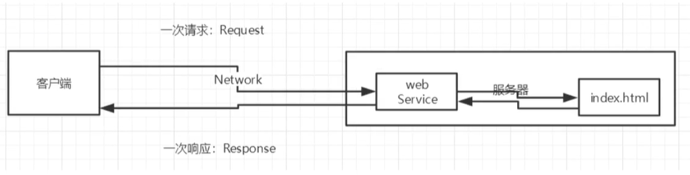
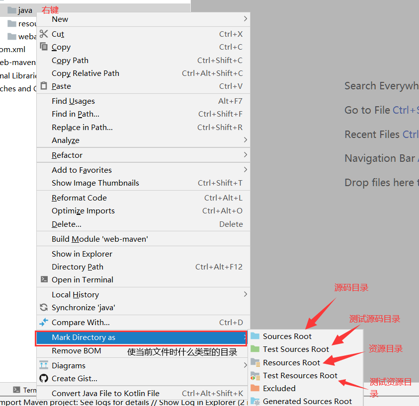
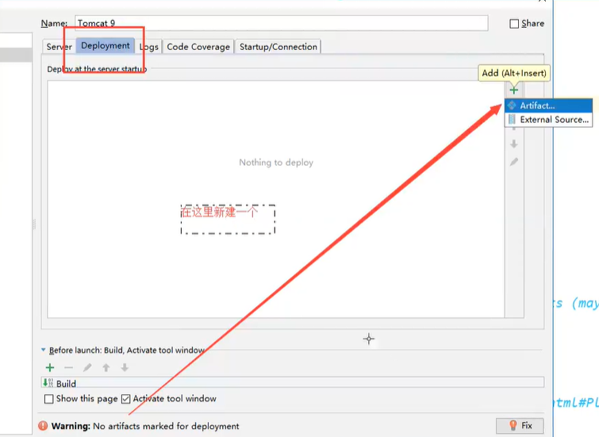
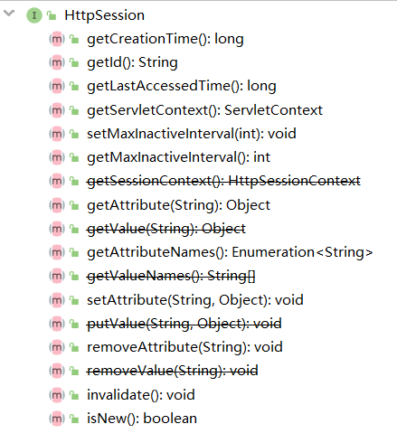

# JavaWeb

Java Web

## 1、 基本概念

### 1.1、 前言

web 开发:

- web : 网页的意思。 www.bing.com
- 静态web
  - html 、 css
  - 提供给所有人看的数据始终不会发生变化！
- 动态web
  - 例如： 淘宝、几乎是所有的网站。
  - 提供给所有人看的数据始终会发生变化、每个人在不同的事件、不同的地点看到的信息各不相同！
  - 技术栈: Servlet/JSP , ASP ， PHP

在Java中， 动态web资源开发的技术统称为 JavaWeb;

### 1.2、 web应用程序

web应用程序: 可以提供浏览器访问的程序；

-  index.html 、 login.html .... 多个web资源，这些web资源可以被外界访问，对外界提供服务；
- 能访问到的任何一个页面或者资源，都存在于这个世界的某一个角落的计算机上；
- URL： 统一资源定位符 根据URL进行指定访问;
- 这个统一的web资源会被放在同一个文件夹下，web应用程序 --> Tomcat(服务器);
- 一个web应用由多部份组成(静态web ， 动态web)；
  - html 、 css 、 js
  - jsp 、servlet
  - Java程序
  - jar包
  - 配置文件(Properites、 xml)

- web应用程序编写完毕后、若想提供给外界访问: 需要一个服务器来统一管理。

### 1.3、 静态web 

- *.html , *.htm ， 这些都是网页的后缀，如果服务器上一直存在这些东西。我们就可以进行读取。



- 静态web存在的缺点
  - Web页面无法动态更新、所有用户看到的都是同一个页面。
    - 轮播图、 点击特效 ： 伪动态
    - JavaScript  实际开发中，它用的最多
    - VBScirpt
  - 它无法和数据库进行交互(数据无法持久化、用户无法互交)

### 1.4、 动态web

页面会动态展示: "Web的页面展示的效果因人而异"。

 

缺点:

- 假如服务器的web资源出现了错误，我们需要重新编写我们的**后台程序**，重新发布。
  - 停机维护。

优点:

- Web页面无法动态更新、所有用户看到的都不是同一个页面。
- 它可以和数据库进行交互(数据持久化: 注册、 商品信息、 用户信息...)

 

## 2、web服务器

### 2.1、 技术讲解

ASP :

- 微软: 国内最早流行的就是ASP;

- 在HTML中嵌入了VB的脚本， ASP + COM;

- 在ASP开发中，基本一个页面都有几千行业务逻辑代码，页面及其混乱;

- 维护成本极高！

- 使用的语言是C#

- 服务器是 IIS 

  ```html
  <html>
      <head>
          <title></title>
      </head>
  	<body>
          <div>
              <div>
                  <span>
                  	<%
                      System.out.println("hello ASP");
                      %>
                  </span>
              </div>
          </div>
          <ul>
              <li></li>
              <li></li>
          </ul>
      </body>
  </html>
  ```


php:

- PHP开发速度很快、功能很强大、跨平台、代码很简单
- 无法承载大访问量的情况(局限性)；


jsp/Servlet:

- sun公司主推的B/S架构；
- 基于Java语言的(几乎所有的大公司，或者一些开源的组件，都是Java写的)；
- 可以承载三高(高性能、高并发、高可用)带来的影响；
- 语法像ASP ， ASP --> JSP ， 加强市场强度。


...

### 2.2、 web服务器

服务器是一种被动的操作、用来处理用户的一些请求和给用户一些响应信息;


**IIS**

微软的: ASP ... ， Windows中自带的。

**Tomcat**

Tomcat是Apache软件基金会(Apache Software Foundation)的Jakarta 项目中的一一个核心项目，最新的Servlet和ISP规范总是能在Tomcat中得到体现，因为Tomcat技术先进、性能稳定，而且**免费**，因而深受Java 爱好者的喜爱并得到了部分软件开发商的认可，成为目前比较流行的Web应用服务器。

Tomcat服务器是一个免费的开放源代码的Web应用服务器，属于轻量级应用服务器，在中小型系统和并发访问用户不是很多的场合下被普遍使用，是开发和调试ISP程序的首选。对于一-个Java初学web的人来说， 它是最佳的选择.

Tomcat实际上运行ISP页面和Servlet。Tomcat最新版本为**9.0。**

...

## 3、Tomcat

### 3.1、 安装tomcat

tomcat 官网: http://tomcat.apahce.org/


下载完毕后解压即可。

### 3.2、 Tomcat启动和配置

文件夹作用:

	

**启动/关闭 Tomcat**

 

访问测试: http://localhost:8080/

可能遇到的问题:

- Java环境变量未配置;
- 闪退问题: 需要配置兼容;
- 乱码问题: 配置文件中设置;

### 3.3、 配置

 

可以配置启动的端口号

- tomcat 的默认端口为: 8080
- mysql : 3306
- http : 80
- https : 443

```xml
<Connector port="8080" protoco1="HTTP/1. 1"
	connecti onTi meout=" 20000"
	redi rectPort="8443" />
```

可以配置主机的名称

- 默认的主机名为 : localhost -> 127.0.0.1
- 默认网站应用存放的位置为 : webapps

```xml
<Host name="localhost" appBase="webapps'
	unpac kWARS= "true autoDep1oy= "true ">
```

**高难度面试题**

请你谈谈网站是如何进行访问的。

1. 输入一个域名: 回车;

2. 检查本机的 C:\windows\System32\drivers\ect\hosts 配置文件下有没有这个域名的映射;

   1. 有: 直接返回对应的ip地址, 这个地址中，有我们需要访问的web程序，可以直接访问。

      ```java
      	127.0.0.1		localhost
      ```

   2. 没有: 去 DNS 服务区找，找到的话就返回，找不到就返回找不到。


### 3.4、 发布一个web网站

- 将自己写的网站，放到服务器(Tomcat) 中指定的web应用的文件夹(webapps)下，就可以访问了。

网站该有的结构:

``` java
--webapps ： Tomcat服务器的web目录
    -- ROOT 
    -- Demo ： 网站的目录名
    	- WEB-INF
    		- classes ： Java程序
    		- lib ： web应用所依赖的jar包
    		- web.xml ： 网站配置文件
    	- index.html/index.jsp ： 默认的首页
   		- static
    		- css
    			- style.css
    		- js
    		- css
    	- ...
```

## 4、HTTP

### 4.1、 什么是HTTP

HTTP(超文本传输协议) 是一个简单的请求 - 响应协议、 它通常运行在TCP之上。

- 文本 ： html , 字符串 , ...
- 超文本 ：图片，音乐，视频，定位，地图...
- 默认端口 : 80

Https : 安全的

- 默认端口 ：443

### 4.2、 两个时代

- http 1.0
  - HTTP/1.0 :  客户端可以与web服务器连接后，只能获得一-个web资源， 断开连接
- http 2.0
  - HTTP/1.1 : 客户端可以与web服务器连接后，可以获得多个web资源。

### 4.3、 HTTP请求

- 客户端 --> 发请求(Request) --> 服务器

百度 ：

```java
Request URL: https://www.baidu.com/		请求地址
Request Method: GET			get方法/post方法
Status Code: 200 OK			状态码：200
Remote（远程） Address: 220.181.38.150:443
```

```java
Accept: text/html					接收的类型			
Accept-Encoding: gzip, deflate, br	
Accept-Language: zh-CN,zh;q=0.9		语言
Cache-Control: max-age=0			缓冲控制
Connection: keep-alive				连接
```

#### 1、 请求行

* 请求行中的请求方式 : GET
* 请求方式 : **GET,  POST,**  HEAD,  DELETE,  PUT,  TRACT...
  * Get : 请求能够携带的参数比较少，大小有限制，会在浏览器的URL地址栏显示数据内容，不安全，但高效
  * post: 请求能够携带的参数没有限制，大小没有限制，不会在浏览器的URL地址栏显示数据内容,安全,
    但不高效

#### 2、 请求头

```jav
Accept				支持的数据类型
Accept-Encoding		支持哪种编码格式  GBK	UTF-8	GB2312	ISO8859-1
Accept-Language		语言环境
Cache-Control		缓冲控制
Connection			请求完成是断开还吃保持连接
HOST				主机
...
```

### 4.4、 HTTP响应

- 服务器 --> 响应 --> 客户端

百度:

```java
Cache-Control: private					缓冲控制
Connection: keep-alive					连接
Content-Encoding: gzip					编码
Content-Type: text/html;charset=utf-8 	类型
```

#### 1、 响应体

```java
Accept				支持的数据类型
Accept-Encoding		支持哪种编码格式  GBK	UTF-8	GB2312	ISO8859-1
Accept-Language		语言环境
Cache-Control		缓冲控制
Connection			请求完成是断开还吃保持连接
HOST				主机
Refresh				告诉客户端，多久刷新一次
Location			让网页重新定位
```

#### 2、响应状态码

200 : 请求响应成功200

3xx : 请求重定向

* 重定向 ： 你重新到我给你的新位置去

4xx : 找不到资源  404

* 资源不存在

5xx : 服务器代码错误  500       502 : 网关错误

**常见面试题 ：**

当你的浏览器中地址栏输入地址并回车的一瞬间到页面能够展示回来,经历了什么?

## 5、Maven项目架构管理工具

**我们为什么要学习这个技术**

 1. 在Javaweb开发中，需要使用大量的jar包，我们需要手动去导入；

 2. 如何能够让一个东西自动帮我们导入和配置这个jar包。

    ​	由此、Maven诞生了！

### 5.1、Maven项目架构管理工具

我们目前用它来就是方便导入jar包的！

Maven的核心思想 : **约定大于配置**

* 有约束，不要去违反。

Maven会规定好你该如何去编写我们的Java代码，必须要按照这个规范来;

### 5.2、下载安装Maven

官网 ：  http://maven.apache.org/ 


下载押解即可。


### 5.3、 配置环境变量

在我们的系统环境变量中

配置如下配置：

* M2_HOME			maven目录下的bin目录
* MAVEN_HOME    maven目录
* 在系统的path中配置      %MAVEN_HOME%\bin

测试Maven是否安装成功，保证必须配置程序！

dos : mvn -version

### 5.4、 阿里云镜像

* 镜像：mirrrs
  * 作用：加速我们的下载。
* 国内建议使用阿里云的镜像

```xml
<mirrors>  放在mirrors内
	<mirror>
        <id>nexus-aliyun</id>
        <mirrorOf>*,!jeecg,!jeecg-snapshots</mirrorOf>
        <name>Nexus aliyun</name>
        <url>http://maven.aliyun.com/nexus/content/groups/pub1ic</url>
    </mirror>
    <!-- 二选一即可 -->
    <mirror>
    	<id>alimaven</id>
      	<name>aliyun maven</name>
      	<url>http://maven.aliyun.com/nexus/content/groups/public/</url>
      	<mirrorOf>central</mirrorOf>       
    </mirror> 
</mirrors>
```

### 5.5、 本地仓库

在本地的仓库 ， 对应有远程仓库。

**建立一个本地仓库 **: localRepository  

```xml
<!-- 位置： 在xml头的下方，紧贴着。 如果不修改则会在C:\Users\用户名\.m2\repostiory位置。
 	仓库路径为 : 绝对路径\apache-maven-3.6.3\maven-repo-->
<localRepository>绝对路径\apache-maven-3.6.3\maven-repo</localRepository>
```

### 5.6、 在IDEA中使用Maven

1. 创建一个MavenWeb项目

   

   

   

   

2.  等待项目导入初始化完毕

   

   

3.  IDEA 中的Maven设置

   注意事项：IDEA项目创建成功后，看- -眼Maven的配置，

   

   

### 5.7、 创建一个普通的Maven项目


这个只有在Web应用下才会有!


### 5.8、 标记文件功能

​	


### 5.9、 在IDEA中配置Tomcat

 


解决警告问题

为什么会有这个问题 ： 我们访问一个网站，需要指定一个文件夹名字。




### 5.10、pom文件

pom.xml 是maven核心文件 


```xml
<?xml version="1.0" encoding="UTF-8"?>

<!-- Maven 的版本和头文件 -->
<project xmlns="http://maven.apache.org/POM/4.0.0" xmlns:xsi="http://www.w3.org/2001/XMLSchema-instance"
  xsi:schemaLocation="http://maven.apache.org/POM/4.0.0 http://maven.apache.org/xsd/maven-4.0.0.xsd">
  <modelVersion>4.0.0</modelVersion>

  <!-- 这里是我们配置的 GAV -->
  <groupId>com.yh</groupId>
  <artifactId>web-maven</artifactId>
  <version>1.0-SNAPSHOT</version>
  <!-- package: 项目的打包方式
    jar: java 应用
    war: javaWeb 应用
   -->
  <packaging>war</packaging>

  <name>web-maven Maven Webapp</name>
  <!-- FIXME change it to the project's website -->
  <url>http://www.example.com</url>

  <!-- 配置 -->
  <properties>
    <!-- 项目的默认构建编码 -->
    <project.build.sourceEncoding>UTF-8</project.build.sourceEncoding>
    <!-- 编译版本 默认1.7 -->
    <maven.compiler.source>1.8</maven.compiler.source>
    <maven.compiler.target>1.8</maven.compiler.target>
  </properties>

  <!-- 项目依赖 -->
  <dependencies>
    <!-- 具体依赖的jar包配置文件 -->
    <dependency>
      <groupId>junit</groupId>
      <artifactId>junit</artifactId>
      <version>4.11</version>
      <scope>test</scope>
    </dependency>
  </dependencies>

  <!-- 项目构建用的东西 -->
  <build>
    <finalName>web-maven</finalName>
    <pluginManagement><!-- lock down plugins versions to avoid using Maven defaults (may be moved to parent pom) -->
      <plugins>
        <plugin>
          <artifactId>maven-clean-plugin</artifactId>
          <version>3.1.0</version>
        </plugin>
        <!-- see http://maven.apache.org/ref/current/maven-core/default-bindings.html#Plugin_bindings_for_war_packaging -->
        <plugin>
          <artifactId>maven-resources-plugin</artifactId>
          <version>3.0.2</version>
        </plugin>
        <plugin>
          <artifactId>maven-compiler-plugin</artifactId>
          <version>3.8.0</version>
        </plugin>
        <plugin>
          <artifactId>maven-surefire-plugin</artifactId>
          <version>2.22.1</version>
        </plugin>
        <plugin>
          <artifactId>maven-war-plugin</artifactId>
          <version>3.2.2</version>
        </plugin>
        <plugin>
          <artifactId>maven-install-plugin</artifactId>
          <version>2.5.2</version>
        </plugin>
        <plugin>
          <artifactId>maven-deploy-plugin</artifactId>
          <version>2.8.2</version>
        </plugin>
      </plugins>
    </pluginManagement>
  </build>
</project>

```


maven由于它的约定大于配置、我们之后可能会遇到我们写的配置文件，无法被导出或者生效的问题，解决方案:

```xml
    <!--在build中配置resources,来防止我们资源导出失败的问题-->
    <build>
        <resources>
            <resource>
                <directory>src/main/resources</directory>
                <excludes>
                    <exclude>**/*.properties</exclude>
                    <exclude>**/*.xm1</exclude>
                </excludes>
                <filtering>false</filtering>
            </resource>
            <resource>
                <directory>src/main/java</directory>
                <includes>
                    <include>**/*.properties</include>
                    <include>**/*.xml</include>
                </includes>
                <filtering>false</filtering>
            </resource>
        </resources>
    </build>
```

### 5.11、 解决遇到的问题

1. Maven 无法使用	3.6.2版本

   解决办法：降级到 3.6.1以前

2. Tomcat闪退

   解决办法： 可能是因为 JAVA_HOME 环境变量未配置

3. IDEA中每次启动都要重复配置Maven

   在IDEA中的全局默认配置中去配置

   

   

4. maven默认web项目中的web.xml版本问题

    

   ​	替换为tomcat默认web.xml版本。

## 6、Servlet

### 6.1、 Servlet简介

* Servlet 就是 sun 公司开发动态web的一门技术。
* Sun 在这些API 中提供了一个接口叫: Servlet ，如果你想开发一个Servlet程序，只需要两个小步骤:
  * 编写一个类，实现Servlet接口。
  * 把开发好的Servlet类部署到web服务器中。

**把实现了Servlet接口的 Java 程序叫做。 Servlet**

### 6.2、 HelloServlet

Servlet接口在Sum公司有两个默认实现类： HttpServlet， GenericServlet


1. 构建一个普通的Maven项目，删掉里面的src目录，以后我们的学习就这个项目里面建立Moudel;这个空的工程就是Maven的主工程；

2. 关于Maven父子工程的理解

   在父项目中会有

   ```xml
       <modules>
           <module>servlet-01</module>
       </modules>
   ```

   子项目中会有

   ```xml
     <parent>
         <artifactId>web-main-maven</artifactId>
         <groupId>com.yh</groupId>
         <version>1.0-SNAPSHOT</version>
     </parent>
   ```

   父项目中的 Java 子项目可以直接使用。

   ```java
   son extends father
   ```

3. Maven环境优化

   1. 修改web.xml为最新的
   2. 将maven的结构搭建完整 java resources

4. 编写一个Servlet程序

   1. 编写一个普通类
   2. 实现Servlet接口，这里我们直接继承HttpServlet

```java
public class HelloServlet extends HttpServlet {

    // 由于 Get 或 Post 只是请求实现的不同方式，可以相互调用，业务逻辑都一样；

    @Override
    protected void doGet(HttpServletRequest req, HttpServletResponse resp) throws ServletException, IOException {
//        ServletInputStream inputStream = req.getInputStream();
        PrintWriter writer = resp.getWriter();// 响应流
        writer.print("HelloServlet!!!");
    }

    @Override
    protected void doPost(HttpServletRequest req, HttpServletResponse resp) throws ServletException, IOException {
        super.doPost(req, resp);
    }
}
```

5. 编写Servlet的映射

   为什么需要映射： 我们写的是java 程序， 但是要通过浏览器访问，而浏览器需要连接web服务器。所以我们需要在web服务中注册我们写的Servlet，还需要给他一个浏览器能够访问的路径。

   ```xml
       <!-- 注册Servlet -->
       <servlet>
           <servlet-name>hello</servlet-name>
           <servlet-class>com.yh.servlet.HelloServlet</servlet-class>
       </servlet>
       <!-- Servlet的访问/请求路径1 -->
       <servlet-mapping>
           <servlet-name>hello</servlet-name>
           <url-pattern>/hello</url-pattern>
       </servlet-mapping>
   ```

6. 配置Tomcat

   

   注意： 配置项目的发布路径

7.  启动测试

### 6.3、 Servlet原理

Servlet是由Web服务器调用，web服务器在收到浏览器请求之后，会：


### 4.6、 mapping

1. 一个Servlet可以指定一个映射路径

   ```xml
       <servlet-mapping>
           <servlet-name>hello</servlet-name>
           <url-pattern>/hello</url-pattern>
       </servlet-mapping>
   ```

2. 一个Servlet可以指定多个映射路径

   ```xml
       <servlet-mapping>
           <servlet-name>hello</servlet-name>
           <url-pattern>/hello1</url-pattern>
       </servlet-mapping>
       <servlet-mapping>
           <servlet-name>hello</servlet-name>
           <url-pattern>/hello2</url-pattern>
       </servlet-mapping>
       <servlet-mapping>
           <servlet-name>hello</servlet-name>
           <url-pattern>/hello3</url-pattern>
       </servlet-mapping>
   ```

3. 一个Servlet可以指定通用映射路径

   ```xml
       <!-- localhost:8080/hello/任意  都可以访问 -->
   	<servlet-mapping>
           <servlet-name>hello</servlet-name>
           <url-pattern>/hello/*</url-pattern>
       </servlet-mapping>
   ```

4. 默认请求路径

   ```xml
       <!-- 默认请求路径。默认就是这个。而不是Tomcat自带的index.jsp 慎用 -->
   	<servlet-mapping>
           <servlet-name>hello</servlet-name>
           <url-pattern>/*</url-pattern>
       </servlet-mapping>
   ```

5. 指定一个后缀 等等...

   ```xml
       <!-- 可以自定义后缀实现请求映射
    		注意点: * 前面不能加项目映射的路径
   		只要是以.yh结尾的都可以访问。
   		如: localhost:8080/hello/abc.yh
   		-->
   	<servlet-mapping>
           <servlet-name>hello</servlet-name>
           <url-pattern>*.yh</url-pattern>
       </servlet-mapping>
   ```

6. 优先级问题

   制定了固有(明确指定)的映射路径优先级最高，如果找不到则会走默认的请求路径；

   ```xml-dtd
   	<!-- 明确指定 -->
   	<servlet-mapping>
           <servlet-name>hello</servlet-name>
           <url-pattern>/hello/*</url-pattern>
       </servlet-mapping>
   	<!-- 默认 -->
   	<servlet-mapping>
           <servlet-name>hello</servlet-name>
           <url-pattern>/*</url-pattern>
       </servlet-mapping>
   ```

### 6.4、 ServletContext

web容器在启动的时候，它会为每个web程序都创建一个对应的ServletContext对象，它代表了当前的web应用。

#### 1、 共享数据

​	我在这个Servlet中保存的数据，可以在另一个Servlet中拿到。

```java
public class HelloServlet extends HttpServlet {
    @Override
    protected void doGet(HttpServletRequest req, HttpServletResponse resp) throws ServletException, IOException {
        // this.getInitParameter(String parameterName);     初始化参数
        // this.getServletConfig();     Servlet配置
        // this.getServletContext();    Servlet上下文

        ServletContext context = this.getServletContext();
        String username = "大呲花";
        context.setAttribute("username" , username);  // 将一个对象保存在了ServletContext中， 名字为： username 。值为：大呲花
    }

    @Override
    protected void doPost(HttpServletRequest req, HttpServletResponse resp) throws ServletException, IOException {
        doGet(req, resp);
    }
}
```

```java
public class GetServlet extends HttpServlet {
    @Override
    protected void doGet(HttpServletRequest req, HttpServletResponse resp) throws ServletException, IOException {
        ServletContext context = this.getServletContext();
        String username = (String) context.getAttribute("username");

        resp.setContentType("text/html");
        resp.setCharacterEncoding("utf-8");
        resp.getWriter().print("名字：" + username);
    }

    @Override
    protected void doPost(HttpServletRequest req, HttpServletResponse resp) throws ServletException, IOException {
        doGet(req, re	sp);
    }
}
```

```xml
    <servlet>
        <servlet-name>hello</servlet-name>
        <servlet-class>com.yh.servlet.HelloServlet</servlet-class>
    </servlet>
    <servlet-mapping>
        <servlet-name>hello</servlet-name>
        <url-pattern>/hello</url-pattern>
    </servlet-mapping>

    <servlet>
        <servlet-name>getc</servlet-name>
        <servlet-class>com.yh.servlet.GetServlet</servlet-class>
    </servlet>
    <servlet-mapping>
        <servlet-name>getc</servlet-name>
        <url-pattern>/getc</url-pattern>
    </servlet-mapping>
```

#### 2、 获取初始化参数

```xml
    <!-- 初始化参数 通过Context.getInitParameter() -->
    <context-param>
        <param-name>url</param-name>
        <param-value>jdbc:mysql://localhost:3306/mybatis</param-value>
    </context-param>
        
	<servlet>
        <servlet-name>gp</servlet-name>
        <servlet-class>com.yh.servlet.ServletDemo03</servlet-class>
    </servlet>
    <servlet-mapping>
        <servlet-name>gp</servlet-name>
        <url-pattern>/gp </url-pattern>
    </servlet-mapping>
```

```java
public class ServletDemo03 extends HttpServlet {
    @Override
    protected void doGet(HttpServletRequest req, HttpServletResponse resp) throws ServletException, IOException {
        ServletContext context = this.getServletContext();
        String url = context.getInitParameter("url");
        resp.getWriter().print(url);
    }

    @Override
    protected void doPost(HttpServletRequest req, HttpServletResponse resp) throws ServletException, IOException {
        doGet(req , resp);
    }
}
```

#### 4、 请求转发


```java
public class ServletDemo04 extends HttpServlet {
    @Override
    protected void doGet(HttpServletRequest req, HttpServletResponse resp) throws ServletException, IOException {
        ServletContext context = this.getServletContext();
        System.out.println("进入了ServletDemo04");
        RequestDispatcher requestDispatcher = context.getRequestDispatcher("/gp");  // 转发的请求路径
        requestDispatcher.forward(req , resp);	// 进入转发的地址
    }

    @Override
    protected void doPost(HttpServletRequest req, HttpServletResponse resp) throws ServletException, IOException {
        doGet(req, resp);
    }
}
```

```xml
    <servlet>
        <servlet-name>gp</servlet-name>
        <servlet-class>com.yh.servlet.ServletDemo03</servlet-class>
    </servlet>
    <servlet-mapping>
        <servlet-name>gp</servlet-name>
        <url-pattern>/gp</url-pattern>
    </servlet-mapping>

    <servlet>
        <servlet-name>ds4</servlet-name>
        <servlet-class>com.yh.servlet.ServletDemo04</servlet-class>
    </servlet>
    <servlet-mapping>
        <servlet-name>ds4</servlet-name>
        <url-pattern>/sd4</url-pattern>
    </servlet-mapping>
```

#### 4、 读取资源文件

Properties

* 在Java目录下新建Properties
* 在resources目录下新建Properties

发现：都被打包到了同一个路径下：classes，我们促成为这个路径为classPath；

思路：需要一个文件流

```java
public class ServletDemo05 extends HttpServlet {
    @Override
    protected void doGet(HttpServletRequest req, HttpServletResponse resp) throws ServletException, IOException {
        ServletContext context = this.getServletContext();
        InputStream is = context.getResourceAsStream("/WEB-INF/classes/db.properties");
        Properties prop = new Properties();
        prop.load(is);
        String username = prop.getProperty("username");
        String password = prop.getProperty("password");
        resp.getWriter().print(username + "\t" + password);
    }

    @Override
    protected void doPost(HttpServletRequest req, HttpServletResponse resp) throws ServletException, IOException {
        doGet(req, resp);
    }
}
```

```properties
username=大呲花
password=123456
```

### 6.5、 HttpServletResponse

web服务器接受到客户端的http请求，针对这个请求，分别创建一个代表请求的HttpServletRequest对象，代表响应的HttpServletResponse对象；

* 如果要获取客户端请求过来的参数：找HttpServletRequest
* 如果要给客户端响应一些信息：HttpServletResponse

#### 1、 简单分类

**负责向浏览器发送数据的方法**

```java
servletOutputStream getOutputStream() throws IOException;
PrintWriter	getWriter()	throws IOException;
```

**负责向浏览器发送响应头的方法**

```java
	void setCharacterEncoding(String var1);
	void setContentLength(int var1);
	void setContentLengthLong(long var1);
	void setContentType(String var1);
	void setDateHeader(String var1, String var2);
	void addDateHeader(String var1, String var2);
	void setHeader(String var1, String var2);
	void addHeader(String var1, String var2);
	void setIntHeader(String var1, String var2);
	void addIntHeader(String var1, String var2);
```

**响应的状态码**

```java
int SC_CONTINUE = 100;
    int SC_SWITCHING_PROTOCOLS = 101;
    int SC_OK = 200;
    int SC_CREATED = 201;
    int SC_ACCEPTED = 202;
    int SC_NON_AUTHORITATIVE_INFORMATION = 203;
    int SC_NO_CONTENT = 204;
    int SC_RESET_CONTENT = 205;
    int SC_PARTIAL_CONTENT = 206;
    int SC_MULTIPLE_CHOICES = 300;
    int SC_MOVED_PERMANENTLY = 301;
    int SC_MOVED_TEMPORARILY = 302;
    int SC_FOUND = 302;
    int SC_SEE_OTHER = 303;
    int SC_NOT_MODIFIED = 304;
    int SC_USE_PROXY = 305;
    int SC_TEMPORARY_REDIRECT = 307;
    int SC_BAD_REQUEST = 400;
    int SC_UNAUTHORIZED = 401;
    int SC_PAYMENT_REQUIRED = 402;
    int SC_FORBIDDEN = 403;
    int SC_NOT_FOUND = 404;
    int SC_METHOD_NOT_ALLOWED = 405;
    int SC_NOT_ACCEPTABLE = 406;
    int SC_PROXY_AUTHENTICATION_REQUIRED = 407;
    int SC_REQUEST_TIMEOUT = 408;
    int SC_CONFLICT = 409;
    int SC_GONE = 410;
    int SC_LENGTH_REQUIRED = 411;
    int SC_PRECONDITION_FAILED = 412;
    int SC_REQUEST_ENTITY_TOO_LARGE = 413;
    int SC_REQUEST_URI_TOO_LONG = 414;
    int SC_UNSUPPORTED_MEDIA_TYPE = 415;
    int SC_REQUESTED_RANGE_NOT_SATISFIABLE = 416;
    int SC_EXPECTATION_FAILED = 417;
    int SC_INTERNAL_SERVER_ERROR = 500;
    int SC_NOT_IMPLEMENTED = 501;
    int SC_BAD_GATEWAY = 502;
    int SC_SERVICE_UNAVAILABLE = 503;
    int SC_GATEWAY_TIMEOUT = 504;
    int SC_HTTP_VERSION_NOT_SUPPORTED = 505;
```

#### 2、 下载文件

1. 向浏览器输出消息（getWriter()/getOutputStream()）
2. 下载文件
   1. 要获取下载文件的路径
   2. 下载的文件名是什么
   3. 设置想办法让浏览器能够支持下载我们需要的东西
   4. 获取下载文件的输入流
   5. 创建缓冲区
   6. 获取OutputStream对象
   7. 将FileOutputStream流写入到buffer缓冲区
   8. 使用OutputStream将缓冲区中的数据输出到客户端

```java
public class FileServlet extends HttpServlet {
    @Override
    protected void doGet(HttpServletRequest req, HttpServletResponse resp) throws ServletException, IOException {
        // 1. 要获取下载文件的路径
        String realPath = this.getServletContext().getResource("WEB-INF/classes/1.jpg").getPath();
        System.out.println(realPath);
        // 2. 下载的文件名是什么
        String fileName = realPath.substring(realPath.lastIndexOf("/")+1);
        System.out.println(fileName);
        // 3. 设置想办法让浏览器能够支持(Content-Disposition)下载我们需要的东西 , 中文文件名URLEncoder.encode编码。否则有可能乱码
        resp.setHeader("Content-Disposition", "attachment;filename=" + URLEncoder.encode(fileName , "UTF-8"));
        // 4. 获取下载文件的输入流
        FileInputStream in = new FileInputStream(realPath);
        // 5. 创建缓冲区
        int len = 0;
        byte[] buffer = new byte[1024];
        // 6. 获取OutputStream对象
        ServletOutputStream out = resp.getOutputStream();
        // 7. 将FileOutputStream流写入到buffer缓冲区
        while((len = in.read(buffer)) > 0){
            // 8. 使用OutputStream将缓冲区中的数据输出到客户端
            out.write(buffer, 0 , len);
        }
        in.close();
        out.close();
    }

    @Override
    protected void doPost(HttpServletRequest req, HttpServletResponse resp) throws ServletException, IOException {
        doGet(req, resp);
    }
}
```

#### 3、 验证码功能

验证怎么来的？

* 前端实现
* 后端实现，需要用的 Java 的图片类，生产一个图片

```java
    @Override
    protected void doGet(HttpServletRequest req, HttpServletResponse resp) throws ServletException, IOException {
        // 如何让浏览器3秒刷新一次
        resp.setHeader("refresh" , "3");

        // 在内存中创建一个图片
        BufferedImage image = new BufferedImage(80, 40, BufferedImage.TYPE_INT_RGB);
        // 得到图片
        Graphics2D g = (Graphics2D) image.getGraphics(); // 笔
        // 设置图片的背景颜色
        g.setColor(Color.green);
        g.fillRect(0, 0, 100, 40);
        // 给图片写数据
        g.setColor(Color.BLUE);
        g.setFont(new Font(null , Font.BOLD , 23));
        g.drawString(makeNum(), 5 , 20);

        // 告诉浏览器，这个请求用图片的方式打开
        resp.setContentType("image/jpeg");
        // 网站存在缓冲
        resp.setDateHeader("expires", -1);
        resp.setHeader("Cache-Control", "on-cache");
        resp.setHeader("Pragma", "on-cache");
        // 把图片写给浏览器
        ImageIO.write(image, "jpg", resp.getOutputStream());

    }

    /**
     * 生成随机数
     * @return 随机数
     */
    private String makeNum(){
        UUID uuid = UUID.randomUUID();
        return uuid.toString().split("-")[0];
    }

```

#### 4、 实现重定向


一个web资源（B）收到客户端（A）请求后，（A）它会通知客户端（B）去访问另一个web资源（C），这个过程叫重定向。

常见场景：

* 用户登入

```java
	void sendRedirect(String var1) throws IOException;
```

```java
    @Override
    protected void doGet(HttpServletRequest req, HttpServletResponse resp) throws ServletException, IOException {
        /*
            原理：
                resp.setHeader("location", "/r/img");
                resp.setStatus(303);
         */
        resp.sendRedirect("/r/img"); // 重定向 第一个/ 代表项目的根目录  / == localhost:8080/       如果项目前面有虚拟的路径。一定要加上
    }
```

**面试题：请你聊聊重定向和转发的区别？**

相同点

* 页面都会实现跳转

不同点

* 请求转发的时候，url不会发生变化
* 重定向时，url地址栏会发生变化

重定向的可见的是在页面变化的同时url跟着改变。其操作的本质就是设置响应头里面的 location为要转发的地址同时改变响应状态码为：302

转发就是在页面变化的同时url不会跟着改变。 其操作的本质就是设置响应码为：307

#### 5、 重定向Demo

```jsp
<%@ page contentType="text/html;charset=UTF-8" language="java" %>
<html>
<body>
<h2>Hello World!</h2>
<%-- 这里提交的路劲、需要寻找到项目的路径 --%>
<%-- 推荐写法 ： ${pageContext.request.contextPath} 代表当前的项目路径 --%>
<form action="${pageContext.request.contextPath}/login" method="get">
    用户名：<input type="text" name="username"> <br>
    密码：<input type="password" name="password"> <br>
    <input type="submit">
</form>
</body>
</html>
```

```jsp
<%@ page contentType="text/html;charset=UTF-8" language="java" %>
<html>
<head>
    <title>Title</title>
</head>
<body>
    <h1>Success</h1>
</body>
</html>
```

```java
public class RequestDemo extends HttpServlet {
    @Override
    protected void doGet(HttpServletRequest req, HttpServletResponse resp) throws ServletException, IOException {
        String username = req.getParameter("username");
        String password = req.getParameter("password");
        System.out.println(username + "\t" +password);
        resp.sendRedirect("/r/success.jsp");
    }

    @Override
    protected void doPost(HttpServletRequest req, HttpServletResponse resp) throws ServletException, IOException {
        doGet(req, resp);
    }
}
```

```xml
    <servlet>
        <servlet-name>RedirectServlet</servlet-name>
        <servlet-class>com.yh.servlet.RedirectServlet</servlet-class>
    </servlet>
    <servlet-mapping>
        <servlet-name>RedirectServlet</servlet-name>
        <url-pattern>/sed</url-pattern>
    </servlet-mapping>

    <servlet>
        <servlet-name>RequestDemo</servlet-name>
        <servlet-class>com.yh.servlet.RequestDemo</servlet-class>
    </servlet>
    <servlet-mapping>
        <servlet-name>RequestDemo</servlet-name>
        <url-pattern>/login</url-pattern>
    </servlet-mapping>
```

### 6.6、 HttpServletReuqest

HttpServletRequest 代表客户端的请求，用户通过Http协议访问服务器；Http中的所有信息会被封住到HttpServletRequest，通过HttpServletRequest的方法，可以获得客户端的所有信息。


#### 1、 获取前端传递的参数

```java
    String getParameter(String var1); *
	String[] getParameterValues(String var1);
    Map<String, String[]> getParameterMap();
    Enumeration<String> getParameterNames();
```


#### 2、 请求转发

```java
    @Override
    protected void doHead(HttpServletRequest req, HttpServletResponse resp) throws ServletException, IOException {
        // 后台接收中文乱码问题
        req.setCharacterEncoding("UTF-8");
        resp.setCharacterEncoding("UTF-8");

        String username = req.getParameter("username");
        String password = req.getParameter("password");
        String[] hobbys = req.getParameterValues("hobbys");
        System.out.println("---------------------------------------");
        System.out.println(username);
        System.out.println(password);
        System.out.println(Arrays.toString(hobbys));
        System.out.println("---------------------------------------");
        // 通过请求转发
        // 此时的 / 代表的时当前web应用
        req.getRequestDispatcher("/success.jsp").forward(req, resp);
    }
```

**面试题：请你聊聊重定向和转发的区别？**

相同点

* 页面都会实现跳转

不同点

* 请求转发的时候，url不会发生变化
* 重定向时，url地址栏会发生变化

重定向的可见的是在页面变化的同时url跟着改变。其操作的本质就是设置响应头里面的 location为要转发的地址同时改变响应状态码为：302

转发就是在页面变化的同时url不会跟着改变。 其操作的本质就是设置响应码为：307

## 7、Cookie、 Seesion

### 7.1、 会话

**会话**：用户打开一个浏览器，点击了很多超链接,访问多个web资源，关闭浏览器，这个过程可以称之为会话****

**有状态会话**：一个同学来过教室，下次再来教室,我们会知道这个同学，曾经来过，称之为有状态会话;

**你能怎么证明你是学生?**

你						学生

1. 发票			学校给你发票
2. 学校登记    学校标记你来过了

**一个网站，怎么证明你来过?**

客户端		服务端

1. 服务端给客户端一个信件，客户端下次访问服务端带上信件就可以了; cookie

2. 服务器登记你来过了,下次你来的时候我来匹配你; session 

### 7.2、 保存会话的两种技术

**cookie**

* 客户端技术 （响应、请求）

**session**

* 服务器技术，利用这个技术，可以保存用户的会话信息。我们可以把信息或者数据放在Session中!

### 7.3、 Cookie


1. 从请求中拿到cookie信息
2. 服务器响应给客户端cookie

```java
Cookie[] = req.getCookies(); 						//获得Cookie
String = cookie.getName(); 							//获得cookie中的key
String = cookie.getValue(); 						//获得cookie中的v1aue
Cookie = new Cookie(String name, String value); 	//新建一个cookie
cookie.setMaxAge(int time);							//设置cookie的有效期
resp.addcookie(Cookie cookie);		 				//响应给客户端一个cookie
```

**cookie：一般会保存在本地的  用户目录下appdata**


**细节问题**

* 一个Cookie只能保存一个信息； Cookie key不能相同，如果出现相同则会顶替。
* 一个web站点可以给浏览器发送多个cookie，最多存放20个cookie；
* Cookie大小有限制4kb；
* 300个cookie浏览器上限

**删除Cookie**

* 不设置有效期，关闭浏览器，自动失效；
* 设置有效期时间为0，不同Servlet中。只要key一样即可。


**编码解码**

```java
URLEncoder.encode(String value, String charset);		// 编码
URLDecoder.encode(String value, String charset);		// 解码
```

### 7.4、 Session(重点)


什么是Session:

* 服务器会给每一个用户（浏览器）创建一个Session对象；
* 一个Session独占一个浏览器，只要浏览器不关闭，这个Session就存在；
* 用户登入之后，整个网站都可以访问。 --> 保存用户的信息，保存购物车的信息。

 

```java
HttpSession = req.getSession();			// 获取session对象
String = getId();						// 获取当前session对象的当前id
boolean = isNew();						// 判断当前session是否为新创建出来的
setAttribute(String name, Object val);	// 设置内容。键值对
Object = getAttribute(String name);		// 获取设置的内容
removeAttribute(String name);			// 删除设置的内容
invalidate();							// 手动注销一个会话。但是浏览器会再次自动创建一个新的
```


```xml
    <-- 自动注销(会话自动过期) -->
	<session-config>
        <!-- 每个Session最多保留的时间、 以分钟为单位、 时间一到自动注销 -->
        <session-timeout>10</session-timeout>
    </session-config>
```


Session和cookie的区别：

* Cookie是把用户的数据写给用户的浏览器，浏览器保存(可以保存多个)
* Session把用户的数据写到用户独占Session中， 服务器端保存 (保存重要的信息,减少服务器资源的浪费)
* Session对象由服务创建;

##  8、JSP

### 8.1、 什么是JSP

Java Server Pages: Java服务器端页面， 也和Servlet- 样，用于动态Web技术! .

最大的特点:

* 写JSP就像在写HTML
* 区别：
  * HTML只给用户提供静态的数据
  * JSP页面中可以嵌入AVA代码，为用户提供动态数据;


### 8.2、JSP原理

思路： JSP到底是怎么执行的

* 代码层面没用任何问题

* 服务器内部工作

  tomcat中有一个work目录;

  IDEA中使用Tomcat的会在IDEA的tomcat中生产一个work目录；

  

  ```
  我电脑的地址：
  C:\Users\北方\.IntelliJIdea2019.2\system\tomcat\Unnamed_web-main-maven\work\Catalina\localhost\r\org\apache\jsp
  ```

  发现页面转变成了Java程序！

  

**浏览器向服务器发送请求，不管访问什么资源，其实都是在访问Servlet!**

JSP最终也会被转换成Java类！

**JSP本质上就是一个Servlet**

```java
  // 初始化
  public void _jspInit() {
  }
  // 销毁
  public void _jspDestroy() {
  }
  // JspServlet
  public void _jspService(final HttpServletRequest request, HttpServletResponse response){
```

**过程**

1. 判断请求

2. 内置一些对象

   ```java
       final javax.servlet.jsp.PageContext pageContext;		// 页面上下文
       javax.servlet.http.HttpSession session = null;			// session
       final javax.servlet.ServletContext application;			// applicationtext
       final javax.servlet.ServletConfig config;				// config
       javax.servlet.jsp.JspWriter out = null;					// out
       final java.lang.Object page = this;						// page：当前页面
   	HttpServletRequest request								// 请求
       HttpServletResponse	response							// 响应
   ```

3. 输出页面之前的一些前置工作

   ```java
         response.setContentType("text/html");					// 设置响应的页面类型
         pageContext = _jspxFactory.getPageContext(this, request, response,
         			null, true, 8192, true);
         _jspx_page_context = pageContext;
         application = pageContext.getServletContext();
         config = pageContext.getServletConfig();
         session = pageContext.getSession();
         out = pageContext.getOut();
         _jspx_out = out;
   ```

   以上这些对象我们在JSP页面中可以直接使用！

4. 

   在JSP页面中; .
   只要是JAVA代码就会原封不动的输出;
   如果是HTML代码，就会被转换为:

   ```java
   out.write("<htm1>\r\n");
   ```

   这样的格式，输出到前端！


### 8.3、JSP基础 

任何语言都有自己的语法，JSP 作为Java技术的一种应用，它拥有一些自己扩充的语法（了解，知道即可！），Java所有语法都支持！

#### 1、 JSP表达式

```jsp
    <%-- JSP表达式
        作用：用来将程序的输出，输出到客户端
            语法： <%= 变量 / 表达式%>>
     --%>
	<%@ page import="java.util.Date" %>
    <%= new Date()%>
```

#### 2、 JSP脚本片段

```jsp
<%-- JSP脚本片段 --%>
    <%
        int sum = 0;
        for (int i = 0; i < sum; i++) {
            if (i % 2 == 0) {
                sum += i;
            }
        }
        out.println("<h1>sum=" + sum + "</h1>");
    %>
```

**脚本片段的再实现**

```jsp
	<%
        int x = 1;
        out.println(x);
    %>
    <%
        int y = 2;
        out.println(x + y);
    %>

    <%-- 在代码中嵌套HTMl元素 --%>
    <%
        for (int i = 0; i < 5; i++) {

    %>
        <h1>Hello Jsp <%= i %></h1>
    <%
        }
    %>
```

#### 3、 JSP声明

```jsp
	<%-- 功能：
            在JSP产生的java文件中的全局为位置编写的代码、 在类中编写的方法。

        无法使用的：
            使用 JSP 的内置对象 如： session 、 out ...
            无法使用JSP的注释
        --%>
    <%!
        static {
           System.out.println("Loading JspServlet");
        }
        private int globalVar = 0;
        public void tom(){
            System.out.println("进入了 tom 方法");
        }
    %>
```

JSP声明：会被编译到JSP生产Java的类中！ 其他的，就会被生成到 _jspService方法中！

```jsp
<% _jspService方法中的代码 %>
<%= 输出到页面中的内容  等同于  out.println() %>
<%! 生产Java类中的代码 %>
<%-- 注释 --%>
```

JSP的注释，不会在客户端显示，而HTML的注释就会！

#### 4、 JSP指令

 ```jsp
    <%@ taglib prefix="prefix" uri="URL" %> 引入标签库

	<%@ page errorPage="path" %>	指定出错后展示的页面
    <%@ page import="Java类" %>		导入包
    <%@ page args... %>

    <%-- @include 会将两个页面合二为一 --%>
    <%@include file="index.jsp"%>
    <h1>网页主题</h1>

    <hr/>
    <%-- JSP标签  jsp:include 拼接页面，本质还是两个 --%>
    <jsp:include page="/index.jsp"/>
    <h1>网页主题</h1>

 ```

```xml
    <!-- 指定所有的web页面错误信息 -->
	<error-page>
        <!-- 错误的状态码 -->
        <error-code>500</error-code>
        <!-- 错误的页面 -->
        <location>/error/500.jsp</location>
    </error-page>
```

### 8.5、 9大内置对象 

* pageConext   存东西
* Request       存东西
* Response
* Session         存东西
* Application   [ServletConext]     存东西
* config    [ServletConfig]
* out
* page  不用理解
* Exception

```jsp
    <%-- 内置对象 --%>
    <%
        pageContext.setAttribute("name1","一号");  // 保存的数据只在一 个页面中有效
        request.setAttribute("name4","四号");      // 保存的数据只在一 次请求中有效，请求转发会携带这个数据
        session.setAttribute("name2","二号");      // 保存的数据只在一次会话中有效，从打开浏览器到关闭浏览器
        application.setAttribute("name3","三号");  // 保存的数据只在服务器中有效，从打开服务器到关闭服务器
    %>

    <%
        //从pageContext耿出,我们通过寻找的方式来
        //从底层到高层(作用域) 双亲委派机制 : page -> request -> session -> application
        String namel = (String) pageContext.findAttribute("name1");
        String name2 = (String) pageContext.findAttribute("name2");
        String name3 = (String) pageContext.findAttribute ("name3");
        String name4 = (String) pageContext.findAttribute("name4");
        String name5 = (String) pageContext.findAttribute("name5"); //不存在
    %>
```

request:客户端向服务器发送请求，产生的数据，用户看完就没用了，比如:新闻，用户看完没用的!

session:客户端向服务器发送请求，产生的数据，用户用完一会还有用， 比如:购物车;

application:客户端向服务器发送请求，产生的数据，-一个用户用完了，其他用户还可能使用，比如:聊天数
据;

### 8.6、 JSP标签，JSTL标签、EL表达式

```xml
        <!-- Maven依赖 -->
		<!-- JSTL 表达式的依赖 -->
        <dependency>
            <groupId>javax.servlet.jsp.jstl</groupId>
            <artifactId>jstl-api</artifactId>
            <version>1.2</version>
        </dependency>
        <!-- standard 标签库 -->
        <dependency>
            <groupId>taglibs</groupId>
            <artifactId>standard</artifactId>
            <version>1.1.2</version>
        </dependency>
```

**JSP标签**

```jsp
<%-- 引用其他文件 --%>
<jsp:include page="index.jsp"/>

<%-- 请求转发, 可携带参数
	http://localhost: 8080/jsptag . jsp ?name=yh&age=18
--%>
<jsp:forward page="jsptag2.jsp">
	<jsp:param name="name" value="yh"></jsp:param>
	<jsp:param name="age" value="18"></jsp:param>
</jsp:forward>
```

**JSTL表达式**

JSTL标签库的使用就是为了弥补HTML的不足;它自定义了序多标签,可以同我们使用,标签的功能和Java代码一样!

**格式化标签**

**SQL**标签

**XML	标签**

**核心标签**(掌握部分)


**JSTL标签库使用步骤**

* 引入对应的taglib
* 使用其中的方法
* **在Tomcat 也需要引入 jstl的包, 否则会报错: JSTL解析错误**

```jsp
<form action="core.jsp" method="get">
        <input type="text" name="username" value="${param.username}">
        <input type="submit">
    </form>
    <%-- 判断用户名是否为admin 如果为admin--%>
    <%-- test：判断的条件  var：结果 true/false  scope：作用域 --%>
    <c:if test="${'admin' == param.username}"  var="isAdmin">
        <c:out value="admin"/>
    </c:if>

    <%-- 输出 value：输出的内容  default：value为空则输出这里 --%>
    <c:out value="${param.username}" default="empty"/>


    <hr/>
    <%-- 定义一个属性 var key = 12 --%>
    <c:set var="key" value="12"/>

    <%-- 类似于 if(){}slse if(){} else{} --%>
    <c:choose>
        <c:when test="${key <= 10}">
            >= 10
        </c:when>
        <c:when test="${key <= 20}">
            >= 20
        </c:when>
        <c:otherwise>
            < 10
        </c:otherwise>
    </c:choose>


    <hr/>
    <%
        List<Integer> list = Arrays.asList(1,2,3,4,5);
        request.setAttribute("list",list);
    %>
    <%-- 遍历循环
            var：    每一次遍历出来的对象
            items:  要便利的对像
            begin:  开始的下标        default 0
            end：   结束的下标        default items.length
            step:   步长             default 1
       --%>
    <c:forEach var="item" items="${list}">
        <c:out value="${item}"/><br/>
    </c:forEach>
```


EL表达式： ${ }

* **获取数据**
* **执行运行**
* **获取web开发的常用对象**
* 调用java方法

EL 提供“.“和“[ ]“两种运算符来存取数据。

当要存取的属性名称中包含一些特殊字符，如 . 或 - 等并非字母或数字的符号，就一定要使用“[ ]“。

如果要动态取值时，就可以用“[ ]“来做，而“.“无法做到动态取值。


EL存取变量数据的方法很简单，例如：${username}。它的意思是取出某一范围中名称为username的变量。

因为我们并没有指定哪一个范围的username，所以它会依序从Page、Request、Session、Application范围查找。

假如途中找到username，就直接回传，不再继续找下去，但是假如全部的范围都没有找到时，就回传""。

|             | 属性范围在EL中的名称 |
| ----------- | -------------------- |
| Page        | PageScope            |
| Request     | RequestScope         |
| Session     | SessionScope         |
| Application | ApplicationScope     |

**隐式对象**

| 术语         | 定义                                                         |
| :----------- | :----------------------------------------------------------- |
| pageContext  | JSP 页的上下文。它可以用于访问 JSP 隐式对象，如请求、响应、会话、输出、servletContext 等。例如，${pageContext.response} 为页面的响应对象赋值。 |
| param        | 将请求参数名称映射到单个字符串参数值（通过调用 ServletRequest.getParameter (String name) 获得）。getParameter (String) 方法返回带有特定名称的参数。表达式 ${param . name}相当于 request.getParameter (name)。 |
| paramValues  | 将请求参数名称映射到一个数值数组（通过调用 ServletRequest.getParameter (String name) 获得）。它与 param 隐式对象非常类似，但它检索一个字符串数组而不是单个值。表达式 ${paramvalues. name} 相当于 request.getParamterValues(name)。 |
| header       | 将请求头名称映射到单个字符串头值（通过调用 ServletRequest.getHeader(String name) 获得）。表达式 ${header. name} 相当于 request.getHeader(name)。 |
| headerValues | 将请求头名称映射到一个数值数组（通过调用 ServletRequest.getHeaders(String) 获得）。它与头隐式对象非常类似。表达式 ${headerValues. name} 相当于 request.getHeaderValues(name)。 |
| cookie       | 将 cookie 名称映射到单个 cookie 对象。向服务器发出的客户端请求可以获得一个或多个 cookie。表达式\${cookie. name .value} 返回带有特定名称的第一个 cookie 值。如果请求包含多个同名的 cookie，则应该使用 \${headerValues. name} 表达式。 |
| initParam    | 将上下文初始化参数名称映射到单个值（通过调用 ServletContext.getInitparameter(String name) 获得）。 |

### 8.7、 JavaBen在JSP中的表现形式

```java
public class Person {
    private Integer id;
    private String name;
    private Integer age;
    private String address;

    public Person(){}

    public Person(Integer id, String name, Integer age, String address) {
        this.id = id;
        this.name = name;
        this.age = age;
        this.address = address;
    }
    
    set/get...
}
```


```jsp
    <%-- 在JSP 中使用 javabean  ORM --%>
    <%
        Person person = new Person();
        person.setId(1);
        person.setName("Yoyo");
        session.setAttribute("person",person);
    %>
    id = ${sessionScope.person.id}
    name = ${person.name}
	

    <%-- userBean 创建对象   id：对象名称  class：类的位置所在  scope：作用域 --%>
    <jsp:useBean id="person" class="com.yh.bean.Person" scope="page"/>
    <%-- 设置值 person.setId(1)  person.setName("Yoyo") --%>
    <jsp:setProperty name="person" property="id" value="1"/>
    <jsp:setProperty name="person" property="name" value="Yoyo"/>
    <jsp:setProperty name="person" property="age" value="18"/>
    <jsp:setProperty name="person" property="address" value="Yoyo集合地"/>
    <%-- 取出值 == person.getId() person.getAge() --%>
    id = <jsp:getProperty name="person" property="id"/>
    name = <jsp:getProperty name="person" property="name"/>
    age = ${person.age}
    address = ${person.address}
```

## 9、 MVC三层架构

什么是MVC: Model View Controller  		模型 	视图	控制器

### 9.1、 早些年


用户直接访问控制层, 控制层就可以直接操作数据库;

```java
servlet --> CRUD --> 数据库
弊端: 程序十分臃肿,不利于维护.	
servlet的代码中:处理请求、响应、视图跳转、处理JDBC、处理业务代码、处理逻辑代码
    
架构: 没有什么是加一层解决不了的!
程序猿调用 --> JDBC --> Mysql Oracle Sq1Serve ...
```

### 9.2、 MVC三层架构


Model

* 业务处理: 业务逻辑(Servier)
* 数据持久层: CRUD(Dao)

View

* 展示数据
* 提供连接发起Servlet请求 (a , form , img....)

Controller (现在 Serlvet)

* 接收用户的请求: (req: 请求信息, session信息...)
* 交给业务层处理对应的代码
* 控制视图的跳转

```java
登入 --> 接收用户的登入器请求 --> 处理用户的请求(获取用户登入的参数,username, password) --> 交给业务层处理登入业务(判断用户名是否正确) --> Dao 层查询用户名和密码是否正确 --> 数据库
```

## 10、 Filter （重点）

Filter: 过滤器,用来过滤网站的数据:

* 处理中文乱码问题
* 登陆验证...


Filter开发步骤:

1. 导包

2. 编写过滤器

   划重点: 导包不要错

   

   实现Filter接口, 重写对应的方法即可.

   ```java
   public class CharacterEncodeFilter implements Filter {
       // 初始化: web服务器启动，就以及初始化了，随时等待过滤对象出现!
       public void init(FilterConfig filterConfig) throws ServletException {
           System.out.println("Filter loading");
       }
   
       // filterChain ： 链
       /*
           1. 过滤中的所有代码，再过滤特定请求的时候都会执行
           2. 必须要让过滤器继续执行
               filterChain.doFilter(servletRequest, servletResponse);
        */
       public void doFilter(ServletRequest servletRequest, ServletResponse servletResponse, FilterChain filterChain) throws IOException, ServletException {
           servletRequest.setCharacterEncoding("UTF-8");
           servletResponse.setCharacterEncoding("UTF-8");
           servletResponse.setContentType("text/html;Charset=UTF-8");
   
           System.out.println(" CharacterEncodingFilter start...");
           filterChain.doFilter(servletRequest, servletResponse);  // 让我们的请求继续走。 如果不写。 程序到这里就会被拦截
           System.out.println(" CharacterEncodingFilter end...");
       }
       // 销毁： web服务器关闭的世界，过滤器会销毁
       public void destroy() {
           System.out.println("Filter closeing");
       }
   }
   ```

3. 在web.xml配置Filter

   ```xml
       <filter>
           <filter-name>CharacterEncodeFilter</filter-name>
           <filter-class>com.yh.filter.CharacterEncodeFilter</filter-class>
       </filter>
       <filter-mapping>
           <filter-name>CharacterEncodeFilter</filter-name>
           <!-- 凡是通过servlet的访问的请求都会被过滤 -->
           <url-pattern>/servlet/*</url-pattern>
           <!-- 凡是访问的都过滤。不推荐使用 -->
           <!-- <url-pattern>/*</url-pattern> -->
       </filter-mapping>
   ```


## 11、 监听器

实现一个监听器接口：（有N种）

1. 编写一个监听器

   实现一个监听器的接口  以HttpSessionListener为例。监听session

   ```java
   
   /**
    * 统计网站在线人数 ： 统计session
    * @Author yh
    * @Date 2020/5/8 10:03
    * @Since 1.8
    */
   public class OnlineCountListener implements HttpSessionListener {
       // 创建 session 监听 ： 看你的一举一动
       // 一旦创建 session 就会触发一次这个时间
       public void sessionCreated(HttpSessionEvent httpSessionEvent) {
           this.plusOnline(httpSessionEvent);
       }
       // 销毁 session 监听
       // 一旦销毁 session 就会触发一次这个时间
       public void sessionDestroyed(HttpSessionEvent httpSessionEvent) {
           this.plusOnline(httpSessionEvent);
       }
   
       /**
        * 增加
        * @param httpSessionEvent
        * @return
        */
       private int plusOnline(HttpSessionEvent httpSessionEvent){
           return this.changeOnline(httpSessionEvent, true);
       }
   
       /**
        * 减少
        * @param httpSessionEvent
        * @return
        */
       private int shear(HttpSessionEvent httpSessionEvent){
           return this.changeOnline(httpSessionEvent, false);
       }
   
       /**
        * 更新在线人数。
        * @param httpSessionEvent 获取session的对象
        * @param flag 标指是加还是剪   true: +  fasel: -
        * @return 先在线人数
        */
       private int changeOnline(HttpSessionEvent httpSessionEvent, boolean flag){
           ServletContext ctx = httpSessionEvent.getSession().getServletContext();
           Integer onlineCount = (Integer) ctx.getAttribute("onlineCount");
           if(onlineCount == null){
               onlineCount = flag ? 1 : 0;
           } else {
               onlineCount = flag ? ++onlineCount : --onlineCount;
           }
           ctx.setAttribute("onlineCount" , onlineCount);
           return onlineCount;
       }
       /*
       	Session销毁:
               1.手动销毁  getSession().invalidate();
               2.自动销毁
        */
   }
   
   ```

2. web.xml中注册监听器

```xml
    <!-- 注册监听器 -->
    <listener>
        <listener-class>com.yh.listener.OnlineCountListener</listener-class>
    </listener>
```
